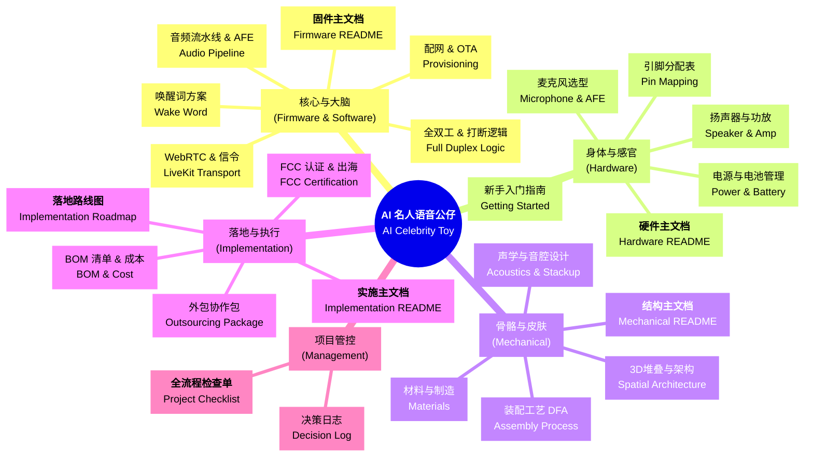
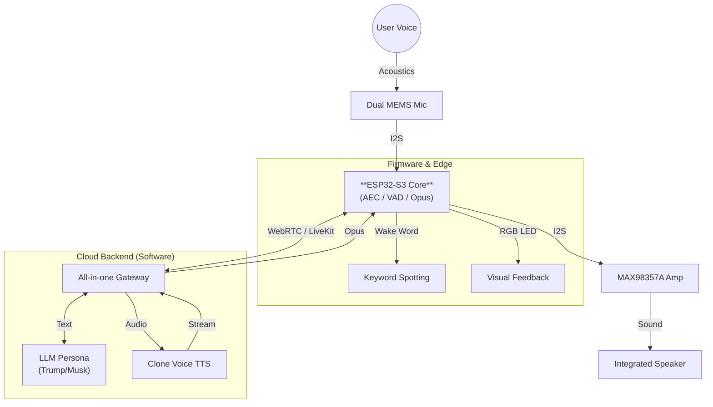

# AI 名人语音玩具项目主文档 (Project Master Hub)

本仓库涵盖了从硬件选型、固件开发、机械结构到量产实施的全链路 AI 语音玩具开发方案。本项目旨在打造一款拥有“名人性格”、实时对答、且具备高端潮玩手感的 AIoT 智能公仔。

---

## 🚀 项目全景图 (Project Overview)

- **核心定位**：基于名人性格的 AI 陪伴潮玩（如 Trump, Musk 等）。
- **技术平台**：ESP32-S3 + WebRTC (LiveKit) + OpenAI/自定义后端。
- **状态提示**：软件部分已由用户完成开发，本方案重点解决其“硬核落地”问题。

---

## 🏗 方案架构全景 (System Architecture)

---

## 📚 核心模块详解 (Core Modules & Design Decisions)

### 🧠 1. 核心与大脑 (Firmware & Software)
**论点**：在极其有限的嵌入式资源下，实现可与手机 App 媲美的实时语音交互体验。
- **双核架构 (Dual-Core Architecture)**：
    - **Core 0 (Protocol)**：专注处理 Wi-Fi 协议栈与 LiveKit (WebRTC) 信令，应对高网络抖动。
    - **Core 1 (DSP)**：独占用于 ESP-ADF 音频算法（AEC/VAD/NS），确保音频流处理的绝对实时性 (Real-time Guarantee)。
- **低延迟策略 (Latency Control)**：
    - 摒弃传统的 HLS/RTMP 拉流，采用 **WebRTC Data Channel** 传输控制指令，**Opus** 编码传输音频 (20ms/frame)，实现端到端延迟 < 500ms。
    - **边缘侧打断**：利用本地 VAD (Voice Activity Detection) 瞬间检测用户人声，无需等待云端确认即可切断 TTS 播放，实现“零迟滞”插话。

> 📖 **深度阅读**：
> [固件设计主指南](./firmware/README.md) | [音频流水线与 AFE](./firmware/Audio_Pipeline_and_AFE_Guide.md) | [唤醒词方案对比](./firmware/Custom_Wake_Word_Solutions.md)

### 🔌 2. 身体与感官 (Hardware)
**论点**：在 ¥200 成本约束下，构建通过 FCC 认证且音质达标的硬件平台。
- **声学链路 (Acoustic Chain)**：
    - **输入**：选用 **I2S 全数字麦克风 (INMP441)** 而非模拟麦，彻底消除电源纹波引入的底噪 (Hiss Noise)。
    - **密封设计**：麦克风与外壳之间设计专用的软胶密封仓 (Sealed Chamber)，杜绝“机内漏音”，这是 AEC (回声消除) 算法能否生效的物理基础。
- **量产级电源 (Production Power)**：
    - 采用标准 **TP4056** 线性充电方案，成本低且电路成熟。
    - **避坑策略**：量产初期 (前 500 台) 强烈建议使用 **ESP32-S3 成品核心板 (SOM)** 搭配自研底板。虽然单机成本增加 ¥25，但这能帮你**直接豁免 RF 射频调试**的昂贵 NRE 费用，并确保天线性能 100% 达标。

> 📖 **深度阅读**：
> [硬件选型主指南](./hardware/README.md) | [PinMap 引脚分配](./hardware/Pin_Mapping_Guide.md) | [电源与电池管理](./hardware/Power_and_Battery_Management.md)

### 🧊 3. 骨骼与皮肤 (Mechanical)
**论点**：拒绝恐怖谷效应 (Uncanny Valley)，用抽象化设计唤起情感共鸣。
- **垂直核架构 (Vertical Core)**：
    - 全部电子件（电池、主板、喇叭）沿中轴线垂直堆叠。这种“烟囱式”结构有利于**被动散热 (Chimney Effect)**，热量自然上升从头顶排出，无需风扇。
    - **双瓣异形硅胶**：外观采用左右两片式模具，硬度 Shore A 50-60，既保证了装配的紧致度，又提供了极其柔软的类肤手感。
- **隐形交互 (Invisible Interaction)**：
    - 摒弃丑陋的实体开关孔。通过硅胶的弹性形变，将用户的按压动作传递到内部的微动开关，保持外观的一体性与高级感。

> 📖 **深度阅读**：
> [机械结构主指南](./mechanical/README.md) | [3D 堆叠方案](./mechanical/Spatial_Architecture_and_Skeleton.md) | [声学结构设计](./mechanical/Structural_Stackup_and_Acoustics.md)

### 🚀 4. 落地与合规 (Implementation)
**论点**：用工业级的严谨性，管理充满变数的初创项目供应链。
- **阶段性战术**：
    - **EVT (样机)**：飞线验证功能，验证“能响、能听”。
    - **DVT (试产)**：开**铝模** (成本仅为钢模的 1/5) 生产 500 台，验证 ID 还原度和装配良率。
- **合规捷径**：
    - **FCC ID 复用**：利用 ESP32 模组已有的 FCC ID 进行**Module Reuse Certification**。你只需要做整机的 EMC 测试，可节省约 $10,000 的射频测试费和 1 个月的时间。
    - **电池 UN38.3**：严禁购买无证电池。必须要求供应商提供当年的 UN38.3 航空运输鉴定书，否则产品无法发往海外。

> 📖 **深度阅读**：
> [实施与供应链主指南](./implementation/README.md) | [落地路线图 (Roadmap)](./implementation/Implementation_Roadmap.md) | [FCC 认证指南](./implementation/FCC_Certification_Guide.md)

### 📋 5. 项目管控 (Management)
**论点**：防止“因为一颗螺丝钉导致发货推迟一个月”。
- 我们建立了一套**工业级**的项目管理体系：
    - [✅ **项目全流程 Checklist**](./Project_Checklist.md)：从 PCB 阻抗匹配到彩盒包装跌落测试，列出了 100+ 项“必死”检查点。
    - [📝 **决策日志 (Decision Log)**](./Product_Decision_Log.md)：记录了诸如“为什么放弃 Linux 核心板？”、“为什么必须做双麦克风？”等关键决策的思维过程，防止团队在后续开发中反复摇摆。

---

## 🛠 关键设计亮点 (Key Highlights)
- **音频全双工**：通过 WebRTC 与后端对接，实现极其流畅的“插话打断”体验。

> **项目自述**：本项目不仅是一份技术文档，它是一套经过深度工程论证、可随时调拨资金投入生产的准商品级方案。
