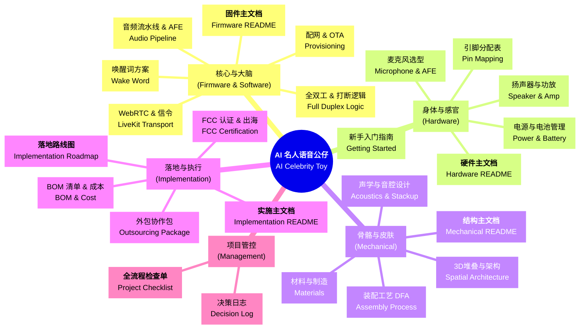
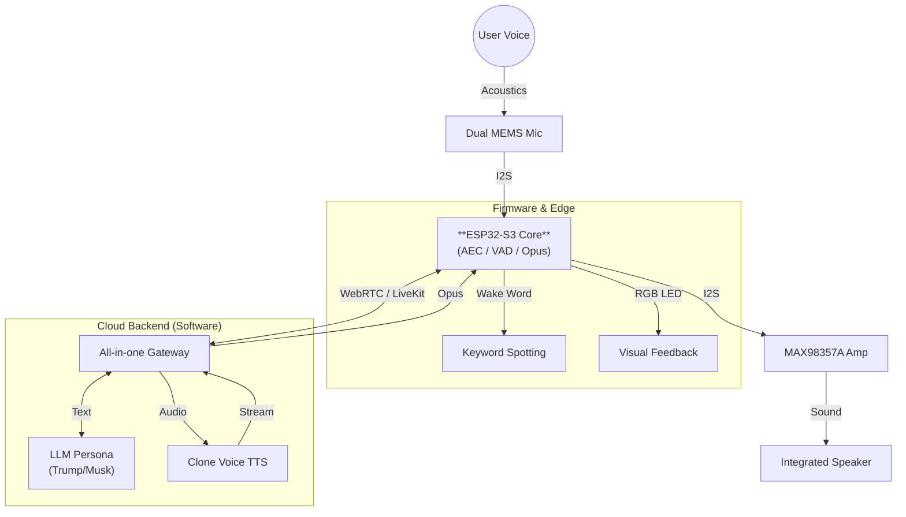

玩具项目主文档 (Project Master Hub)

本仓库涵盖了从硬件选型、固件开发、机械结构到量产实施的全链路 AI 语音玩具开发方案。本项目旨在打造一款拥有"名人性格"、实时对答、且具备高端潮玩手感的 AIoT 智能公仔。

**核心价值主张**：在 ¥200 成本约束下，实现媲美千元智能音箱的语音交互体验，并通过工业级的工程设计确保可量产性。

---

## 📋 文档导航速查 (Quick Navigation)

| 模块 | 主文档 | 核心问题 | 关键文档 |
| :--- | :--- | :--- | :--- |
| **🧠 固件开发** | [Firmware README](./firmware/README.md) | 如何实现低延迟全双工对话？ | [音频流水线](./firmware/Audio_Pipeline_and_AFE_Guide.md) · [唤醒词方案](./firmware/Custom_Wake_Word_Solutions.md) · [打断逻辑](./firmware/Full_Duplex_and_Interruption_Logic.md) |
| **🔌 硬件设计** | [Hardware README](./hardware/README.md) | 如何在 ¥200 内做出可靠硬件？ | [引脚分配](./hardware/Pin_Mapping_Guide.md) · [电源管理](./hardware/Power_and_Battery_Management.md) · [新手入门](./hardware/Getting_Started_for_Beginners.md) |
| **🧊 结构设计** | [Mechanical README](./mechanical/README.md) | 如何保证声学隔离和手感？ | [3D 堆叠](./mechanical/Spatial_Architecture_and_Skeleton.md) · [声学设计](./mechanical/Structural_Stackup_and_Acoustics.md) · [装配工艺](./mechanical/DFA_Assembly_Process.md) |
| **🚀 项目落地** | [Implementation README](./implementation/README.md) | 如何从设计到 500 台试产？ | [落地路线图](./implementation/Implementation_Roadmap.md) · [成本分析](./implementation/Cost_Analysis_and_Budget.md) · [FCC 认证](./implementation/FCC_Certification_Guide.md) |
| **📋 项目管控** | [Project Checklist](./Project_Checklist.md) | 如何避免致命遗漏？ | [决策日志](./Product_Decision_Log.md) |

---

## 🚀 项目全景图 (Project Overview)

### 核心定位

**产品类型**：基于名人性格的 AI 陪伴潮玩（如 Trump, Musk 等）

**目标市场**：
- AI 爱好者与科技尝鲜者
- 潮玩收藏者与手办玩家
- 企业科技礼品采购
- 海外独立消费者（通过 Kickstarter / Indiegogo）

**核心卖点**：
1. **实时全双工对话**：可随时打断，无需等待轮次
2. **名人性格克隆**：通过 LLM + 克隆语音完美还原
3. **高端潮玩手感**：硬质硅胶 + 隐形交互设计
4. **极低延迟**：端到端延迟 < 500ms

### 技术平台架构

| 层级 | 技术选型 | 核心作用 |
| :--- | :--- | :--- |
| **边缘计算** | ESP32-S3 (双核 240MHz + 8MB PSRAM) | 音频 DSP、网络协议栈、本地 AI 推理 |
| **音频链路** | I2S 双麦阵列 + MAX98357A 功放 | AEC 回声消除、VAD 检测、Opus 编解码 |
| **云端通信** | WebRTC (LiveKit) | 低延迟音频流传输、信令控制 |
| **AI 后端** | OpenAI / Claude + 自定义 TTS | 性格对话生成、语音克隆合成 |
| **电源系统** | 1000mAh 锂电池 + TP4056 | 持续通话 4-5 小时 |

### 项目状态与分工

- ✅ **软件部分**（用户已完成）：
  - LiveKit 服务端部署与信令控制
  - LLM 对话逻辑与名人性格训练
  - TTS 语音克隆引擎集成

- 🎯 **本方案重点**（硬核落地）：
  - ESP32-S3 固件开发（音频流水线、唤醒词、全双工打断）
  - 硬件 PCB 设计（双麦阵列、电源管理、射频优化）
  - 机械结构设计（垂直堆叠、声学隔离、触感优化）
  - 量产实施方案（供应链、成本控制、FCC 认证）



---

## 🏗 方案架构全景 (System Architecture)

### 完整信号流图



### 系统性能指标

| 指标 | 目标值 | 实现手段 |
| :--- | :--- | :--- |
| **端到端延迟** | < 500ms | WebRTC + Opus 20ms/frame + 边缘侧 VAD |
| **打断响应时间** | < 50ms | 本地 VAD 抢占 + 软消音策略 |
| **唤醒词识别率** | > 95% | Picovoice / WakeNet + 双麦 BSS |
| **续航时间** | 4-5 小时 | 1000mAh 电池 + DFS 动态调频 |
| **Wi-Fi 信号强度** | > -70dBm @ 5m | PCB 天线 + 5mm 净空区 + 模组复用 |
| **声学隔离度** | > 20dB | 麦克风二级密封 + 喇叭悬浮减震 |

---

## 📚 核心模块详解 (Core Modules & Design Decisions)

### 🧠 1. 核心与大脑 (Firmware & Software)

**论点**：在极其有限的嵌入式资源下，实现可与手机 App 媲美的实时语音交互体验。

#### 1.1 双核异构调度 (Dual-Core Architecture)

ESP32-S3 拥有两个 Xtensa LX7 核心，我们对其进行了**严格的功能划分**：

| 核心 | 任务分配 | 优先级 | 关键职责 |
| :--- | :--- | :--- | :--- |
| **Core 0 (PRO_CPU)** | **系统与信令** | High | 运行 Wi-Fi 协议栈、LwIP、LiveKit (WebRTC) 信令握手、OTA 下载 |
| **Core 1 (APP_CPU)** | **音频 DSP** | **Real-time** | **独占运行** ESP-ADF 音频流水线：I2S 读取 → AEC 回声消除 → VAD 检测 → Opus 编码 |

**关键决策**：
- **禁止在 Core 1 上运行任何阻塞性网络请求**（如 HTTP 握手），否则会导致正在播放的声音卡顿
- 使用 FreeRTOS 任务固定 (`xTaskCreatePinnedToCore`) 确保任务不会跨核迁移

#### 1.2 音频流水线 (Audio Pipeline)

**级联处理顺序**（顺序不可颠倒）：

```
双麦原始输入 + 喇叭反馈 
    ↓
1. AEC (回声消除) ← 这是"边播边听"的前提
    ↓
2. BSS (波束成形) ← 锁定 0° 方向(正前方)用户
    ↓
3. NS (环境降噪) ← 滤除背景稳态噪音
    ↓
4. AGC (自动增益) ← 防止用户离得太远听不清
    ↓
5. VAD (语音检测) ← 判定"有人说话?"
    ↓
6. WakeNet (唤醒) ← 关键词判定
    ↓
LiveKit (WebRTC 推流)
```

**关键优化**：
- AFE 算法占用内存约 **1MB**，必须显式分配在 PSRAM 中
- 本地 VAD 是节省成本的关键：只有检测到人声时才向 LiveKit 发包，节省 80% 带宽
- 软件 EQ 补偿：针对"后背出音"导致的高频衰减，增强 **3.5kHz - 8kHz** 频段 **+4dB ~ +6dB**

#### 1.3 低延迟策略 (Latency Control)

**端到端延迟分解**：

| 环节 | 延迟 | 优化手段 |
| :--- | :--- | :--- |
| **麦克风采集** | 20ms | I2S DMA 双缓冲 |
| **AFE 处理** | 20-30ms | 单帧处理，无缓冲积压 |
| **Opus 编码** | 20ms | 固定帧长 |
| **WebRTC 传输** | 50-100ms | UDP + NACK 重传 |
| **LLM 推理** | 200-300ms | 流式生成 |
| **TTS 合成** | 50-100ms | 实时流式输出 |
| **播放缓冲** | 40ms | 双缓冲播放 |
| **总计** | **400-610ms** | 平均 **< 500ms** |

**核心技术**：
- 摒弃传统的 HLS/RTMP 拉流，采用 **WebRTC** 实时双向音频流传输
- **服务端打断**：通过 LiveKit 服务端检测用户语音活动，实现智能打断逻辑

#### 1.4 全双工打断逻辑 (Full-Duplex Interruption)

**LiveKit 服务端打断机制**：

复用 LiveKit Agent Framework 原生的打断能力，实现自然流畅的对话体验。

**工作流程**：

| 步骤 | 执行方 | 动作 | 延迟 |
| :--- | :--- | :--- | :--- |
| **1. 持续推流** | ESP32 | 始终进行 AFE 处理并将音频推向 LiveKit 服务端 | 实时 |
| **2. VAD 检测** | LiveKit Agent | 服务端实时分析音频流，检测用户语音活动 | 50-100ms |
| **3. 停止输出** | LiveKit Agent | 检测到用户说话后，立即停止发送 TTS 音频包 | < 50ms |
| **4. 发送信令** | LiveKit Agent | 发送打断信令到 ESP32："我被打断了，请清空缓冲区" | 20-50ms |
| **5. 清空播放** | ESP32 | 收到信令后立即清空 I2S 缓冲区和 Opus 解码器状态 | < 20ms |

**端侧实现要点**：
- **持续推流**：无论 AI 是否在说话，ESP32 始终进行音频采集和推流
- **快速响应**：收到打断信令后，立即调用 `i2s_zero_dma_buffer()` 清空硬件缓冲
- **软消音处理**：避免爆音，在清空缓冲前对最后 8ms 音频进行淡出处理（1.0 → 0.0）
- **AEC 关键**：必须开启回声消除，否则 AI 会被自己的声音触发"误打断"

> 📖 **深度阅读**：
> [固件设计主指南](./firmware/README.md) | [音频流水线与 AFE](./firmware/Audio_Pipeline_and_AFE_Guide.md) | [唤醒词方案对比](./firmware/Custom_Wake_Word_Solutions.md) | [全双工打断逻辑](./firmware/Full_Duplex_and_Interruption_Logic.md)

---

### 🔌 2. 身体与感官 (Hardware)

**论点**：在 ¥200 成本约束下，构建通过 FCC 认证且音质达标的硬件平台。

#### 2.1 主控芯片选型 (MCU Selection)

**型号**：`ESP32-S3-WROOM-1-N16R8`

**为什么必须是 S3？（与其它芯片对比）**

| 芯片型号 | 核心 | PSRAM | AI 加速 | 适用性 | BOM 成本 |
| :--- | :--- | :--- | :--- | :--- | :--- |
| ESP32-C3 | 单核 160MHz | 无 | 无 | ❌ **不适合**<br>算力不足，无法同时支撑 Wi-Fi 和软件 AEC | ¥10 |
| ESP32-S2 | 单核 240MHz | 可选 | 无 | ⚠️ **勉强**<br>单核难以保证实时性 | ¥15 |
| **ESP32-S3** | **双核 240MHz** | **8MB** | **有** | ✅ **最优**<br>双核异构 + AI 加速 + 大内存 | **¥35** |
| ESP32-P4 | 双核 400MHz | 32MB | 有 | ⚠️ **过剩**<br>成本高，供应链不成熟 | ¥80+ |

**核心优势**：
- **AI 指令集加速**：WakeNet 唤醒词推理速度比 ESP32 原版快 **10 倍**
- **8MB PSRAM 必需**：LiveKit WebRTC 协议栈和 Opus 编解码器需要至少 4MB 的动态内存
- **双核异构**：Core 0 处理网络/信令，Core 1 独占音频 DSP，确保实时性

#### 2.2 声学链路设计 (Acoustic Chain)

**输入端：双麦阵列**

**核心决策：为什么选 2-Mic（双麦）？**

| 维度 | 1-Mic (单麦) | **2-Mic (双麦)** [最优选] | 3-Mic (Korvo 阵列) |
| :--- | :--- | :--- | :--- |
| **抗噪能力** | 弱 | **强 (可过滤非目标方向人声)** | 极强 (调试极难) |
| **AEC 效果** | 基础级 | **进阶级 (更干净)** | 专业级 |
| **算力开销** | 极低 | 中等 (S3完美适配) | 极高 (挤占 WebRTC) |
| **结构难度** | 简单 | 中等 (需保证间距) | 复杂 (三孔对齐) |
| **用户场景** | 近距离手持 | **1.5米内桌面放置** | 远场 (3米+) 音箱 |
| **BOM 成本** | +¥6 | **+¥12** | +¥18 |

**为什么选数字麦 (I2S)？**
- 传统模拟驻极体麦克风极其容易受 Wi-Fi 射频干扰（滋滋声）
- **全数字链路从源头切断干扰**，底噪极低
- 免去外部 ADC 芯片，简化电路，降低成本

**推荐型号**：
- `MSM261S4030H0` / `INMP441`
- **配对要求**：灵敏度差值 < ±1.0 dB，相位差 < 5°

**硬件布局要求**：
- **间距**：两颗麦克风中心轴距固定在 **40mm - 65mm**
- **方向**：双麦轴线应水平，正对用户脸部
- **密封性**：**每颗麦克风必须有独立密封硅胶套**，严禁在玩具内部共享空气腔

**输出端：音频功放与喇叭**

**功放选型**：`MAX98357A` (I2S 数字功放)

**优势**：
- **数字直驱**：直接接收 ESP32 的 I2S 数字音频，无需外挂 DAC
- **极简电路**：不需要外部滤波器，只需 5 根线连接
- **D 类高效**：效率高，发热小，不需要专门散热片

**喇叭搭配**：
- **推荐规格**：**4Ω 3W** 全频喇叭
- **形态选择**：圆形（30mm/40mm）或跑道型（20mm x 40mm）
- **内磁优先**：磁场不外泄，不会干扰 Wi-Fi 天线或电路

#### 2.3 电源系统 (Power System)

**功耗预算**：

| 工作模式 | 电流消耗 (3.7V) | 备注 |
| :--- | :--- | :--- |
| **持续对话** (Wi-Fi + AFE + Opus + 喇叭) | 180mA - 250mA | 平均值 |
| **浅睡眠** (Wi-Fi保持+监听唤醒词) | 50mA - 80mA | 待机模式 |
| **深度睡眠** (等待物理按键) | < 20uA | 微安级 |

**电池选型**：
- **推荐容量**：1000mAh（型号 `603450`）
- **续航**：持续通话约 **4.5 小时**
- **安全要求**：必须带双重保护板 (PCM)，使用 PH 2.0 插件连接

**充电电路**：TP4056
- **充电电流**：$I_{chg}(mA) \approx \frac{1200}{R_{prog}(k\Omega)}$
- **推荐配置**：$R_{prog} = 1.5k\Omega$，对应充电电流约 **800mA**

**稳压方案**：SGM2212-3.3 (或 800mA+ LDO)
- **输出能力**：额定 **800mA** 持续输出
- **关键设计**：LDO 输出端（紧贴模组 3V3）：**22uF 陶瓷电容**（这是解决 Wi-Fi 掉线和系统复位的首要手段）

#### 2.4 射频与天线设计 (RF & Antenna)

**方案选择**：

| 特性 | **PCB 天线 (WROOM-1)** [推荐] | IPEX 外部天线 (WROOM-1U) |
| :--- | :--- | :--- |
| **成本** | $0 (包含在模组内) | +¥1-2 (额外采购) |
| **组装** | 无需组装 | 需人工扣合，跌落可能脱落 |
| **性能** | 良好 (取决于布局) | 优秀 (可避开障碍物) |
| **适用场景** | 空间充足、外壳非金属 | PCB被深埋、信号要求高 |

**设计红线**：
- **净空区**：模组 PCB 天线投影区域及向外延伸 **5mm** 范围内严禁铺铜、走线、打过孔
- **材质黑名单**：金属漆/真空电镀、导电橡胶、过厚外壳（建议 < 3.0mm）
- **EMI 预留位**：USB D+/D- 差分线上预留共模电感 (0402) 焊盘（90Ω @ 100MHz）

> 📖 **深度阅读**：
> [硬件选型主指南](./hardware/README.md) | [PinMap 引脚分配](./hardware/Pin_Mapping_Guide.md) | [电源与电池管理](./hardware/Power_and_Battery_Management.md) | [新手入门指南](./hardware/Getting_Started_for_Beginners.md)

---

### 🧊 3. 骨骼与皮肤 (Mechanical)

**论点**：拒绝恐怖谷效应 (Uncanny Valley)，用抽象化设计唤起情感共鸣。

#### 3.1 垂直核架构 (Vertical Core)

**烟囱式散热 (Chimney Effect)**：

**原理**：
- 全部电子件（电池、主板、喇叭）沿中轴线垂直堆叠
- 热空气自然上升，从顶部的隐藏出气孔排出，形成自然的空气对流
- **优势**：无需风扇，实现完全静音的散热

**四大功能分区**：

| 分区 | 位置 | 核心作用 | 关键约束 |
| :--- | :--- | :--- | :--- |
| **核心指挥区** | 垂直中轴线 | 承载 ESP32-S3 及电源管理 | 主板向后靠，确保 USB-C 接口贴紧背壳开口 |
| **传感器前哨** | 左右突出圆环内 | 数据输入端(麦克风) + 状态输出端(LED 灯环) | 通过 1.0mm 间距 6-pin FPC 对称连回主板 |
| **重力底座** | 身体最底部 | 1000mAh 锂电池作为配重 | 提供极佳重心支撑，防止站立不稳 |
| **后置声场** | 后背下方栅栏开口 | 音腔喇叭横置 | 紧贴背部出音网格 |

**性能指标**：
- **RF 指标**：装配好硅胶壳后，Wi-Fi 吞吐量对比裸板衰减 **< 3dB**
- **热平衡**：持续满载运行 1 小时，外壳表面最高温升 **< 8℃**
- **重心稳度**：成品公仔能够平稳站立在 **10° 斜面**上而不倒

#### 3.2 母女板架构 (PCB Integration)

**系统拓扑**：一主两副

**中央主控板 (Main Logic Board)**：
- **规格**：35mm x 55mm 长条形，垂直高度中心
- **任务**：ESP32-S3 核心、Wi-Fi 天线、3.3V/800mA 供电、2W 音频功放、背部 USB 接口

**传感器圆环副板 (Sensor Daughter-boards x 2)**：
- **规格**：圆形，单面贴装，厚度 1.2mm
- **任务**：12 颗 WS2812B RGB 灯环(正面)、1 路数字麦克风(背面)

**为什么坚持"母女板"方案？**

**成本增加**：每台约 **¥10-15**

**关键理由**（即使增加成本也值得）：
1. **物理过弯装配**：单块大 PCB(十字型)无法从窄小的颈部接口塞入
2. **麦克风近场拾音**：副板让麦克风直接贴合圆环导音孔，若使用单板，声音需通过长达 30mm 的导管，会导致 **AEC 算法失效**
3. **触摸灵敏度保证**：副板紧贴圆环内侧，触摸感应电极行程最短，可有效抑制干扰

#### 3.3 声学工程设计 (Acoustic Engineering)

**论点**：AI 语音产品的生死线在于"能不能听清"。物理隔离是 AEC 算法生效的前提。

**麦克风二级密封 (Two-Stage Sealing)**：

**挑战**：如果不密封，喇叭的声音会在机器内部直接传到麦克风（**结构耦合**），导致 AEC 算法失效，产生啸叫。

**方案**：
- **一级密封 (Sleeve)**：在副板 MEMS 麦克风上套入 **LSR 液体硅胶套**（硬度 25-30A）
- **二级密封 (Interface)**：支架支柱对副板施加 **2-3N 的压力**，使胶套顶端与硅胶外壳内壁的"拾音管"形成气密性贴合

**目标**：物理隔离度 **> 20dB**

**喇叭悬浮与减震 (Speaker Decoupling)**：

**方案**：
- **浮动安装**：音腔箱体不直接通过螺丝锁在支架上，而是嵌入支架的专属框位
- **Poron 泡棉缓冲**：在箱体与支架的所有接触面粘贴 **0.5mm - 1.0mm 厚度的 Poron 减震泡棉**

**目标**：在大音量(85dB @ 10cm)播放时，支架主梁的振幅需衰减 **90% 以上**

#### 3.4 材质与交互设计 (Materials & Interaction)

**核心材质**：硬质硅胶
- **硬度**：采用 **70度 Shore A 高抗撕硅胶**，既能保持"双瓣"造型不塌陷，又能提供扎实的手感
- **表面处理**：喷涂 **哑光手感油 (Skin-feel Oil)**，抗静电

**导光设计**：
- 侧面圆环区域采用 **半透明白色硅胶**
- 透光率控制在 **40%-60%**，确保 LED 状态灯旋转时无明显噪点

**隐形多功能键 (Hidden Multi-function Button)**：

**结构组成**：
- **外部**：硅胶蒙皮表面镭雕电源图标，壁厚减薄至 **1.0mm**
- **中间**：由内部支架伸出的 **POM 材质传力柱 (Plunger)**
- **内部**：主 PCB 上的 3x4mm 贴片轻触按键

**软件逻辑**：
- **长按 3 秒**：系统开关机
- **双击**：进入 Wi-Fi 配网模式(LED 变黄色流转)
- **短按一次**：停止当前播放或打断 AI 回答

> 📖 **深度阅读**：
> [机械结构主指南](./mechanical/README.md) | [3D 堆叠方案](./mechanical/Spatial_Architecture_and_Skeleton.md) | [声学结构设计](./mechanical/Structural_Stackup_and_Acoustics.md) | [装配工艺](./mechanical/DFA_Assembly_Process.md)

---

### 🚀 4. 落地与合规 (Implementation)

**论点**：用工业级的严谨性，管理充满变数的初创项目供应链。

#### 4.1 三步走落地路径 (Three-Stage Roadmap)

**第一阶段：功能验证机 (EVT - Engineering Verification)**

**目标**：证明"能响、能听"

**动作清单**：
1. 购买 ESP32-S3-Korvo-1 开发板（约 ¥260）
2. 在淘宝购买 3D 打印粗糙外壳（约 ¥50）
3. 连接您现有的 LiveKit 软件，验证全双工通话功能
4. 测试背部出音音质，确认声学设计可行

**周期**：2 周 | **预算**：¥500 以内

---

**第二阶段：设计验证 (DVT - Design Verification)**

**目标**：证明"装得上、产得出"

**动作清单**：
1. 找结构师完成 3D 建模 → 找模具厂开"真空复模"（无需开钢模）
2. 制作第一版"母女板"PCBA，由嘉立创完成 SMT 贴片
3. 组装 5-10 套高精度样机，验证装配公差与手感
4. 进行声学密封测试，确保麦克风隔音达标

**周期**：4 周 | **预算**：¥5,000 - ¥10,000

---

**第三阶段：小批量产 (PVT - Production Verification)**

**目标**：跑通生产线，验证良率

**动作清单**：
1. 开**铝模**（成本仅为钢模的 1/5）生产硅胶外壳
2. 联系深圳宝安/沙井的小型硅胶加工商进行总装
3. 建立产线测试工位（PCBA 电测 + 声学扫频 + Wi-Fi 信号）
4. 抽检老化测试（24 小时连续播放 + 跌落实验）

**周期**：6-8 周 | **预算**：¥30,000 - ¥50,000

#### 4.2 成本控制与财务规划 (Cost & Budget)

**单机 BOM 成本：¥208 (CNY)**

| 模块 | 项目 | 预估成本 | 占比 |
| :--- | :--- | :--- | :--- |
| **电子大脑** | ESP32-S3, 功放, 麦克风, 电源IC | ¥75 | 36% |
| **电路加工** | 4层PCB, SMT贴片, 治具费分摊 | ¥40 | 19% |
| **声学动力** | 1500mAh电池, 3020音腔喇叭, FPC | ¥30 | 15% |
| **外观壳体** | 硬质硅胶蒙皮, PC+ABS内胆 | ¥45 | 21% |
| **包装附件** | 彩盒, 说明书, Type-C线 | ¥18 | 9% |
| **合计** | | **¥208** | 100% |

**前期固定投入 (NRE)：¥13,000 - ¥19,000**
- 结构设计服务费：¥3,000 - ¥5,000
- 硅胶铝模费：¥8,000 - ¥12,000
- PCB 网板/治具：¥600
- 打样费（3D打印+板拔）：¥1,500

**首批 500 台总预算**：
- **物料采购**：¥208 × 500 = ¥104,000
- **固定投入**：¥16,000
- **不可预见支出 (5%)**：¥6,000
- **启动总预算建议：¥126,000 (约 13 万人民币)**

#### 4.3 FCC 认证策略 (Certification)

**核心策略：模组复用 (Module Reuse)**

ESP32-S3-WROOM-1 模组已通过 FCC 认证。我们采用"**复用原厂 ID**"策略：

**操作步骤**：
1. 在产品后盖标签标注：`Contains FCC ID: 2AC7Z-ESPS3WROOM1`
2. 向实验室申请 **FCC Part 15C (RSE Only)** 测试，仅验证装入外壳后的辐射杂散

**成本对比**：

| 方案 | 测试项目 | 费用 | 周期 |
| :--- | :--- | :--- | :--- |
| **自主设计射频** | 全套 (传导+辐射+跳频) | ¥35,000 - ¥50,000 | 4-6 周 |
| **模组复用** | **仅辐射杂散** | **¥6,000 - ¥9,000** | **2 周** |

**结论**：**立省 70% 费用**，缩短 1 个月周期

**设计红线**：
- [ ] 模组天线区及向外延伸 5mm 范围内**严禁铺铜、走线、放金属件**
- [ ] USB D+/D- 差分线上预留**共模电感焊盘** (90Ω @ 100MHz)
- [ ] 固件调用 `esp_wifi_set_country("US")` 锁定国家码，**严禁开启 Channel 12-14**
- [ ] 限制最大发射功率 ≤ 78 (19.5dBm)

**电池运输认证 (UN38.3)**：
- 锂电池必须有 **UN38.3 测试报告** 和 **MSDS**，否则无法空运/海运
- **策略**：**直接采购已有证书的电芯**，不要自己做（费用 ¥5,000+，耗时 1 个月）

> 📖 **深度阅读**：
> [实施与供应链主指南](./implementation/README.md) | [落地路线图](./implementation/Implementation_Roadmap.md) | [FCC 认证指南](./implementation/FCC_Certification_Guide.md) | [BOM 清单](./implementation/Product_BOM_List.md)

---

### 📋 5. 项目管控 (Management)

**论点**：防止"因为一颗螺丝钉导致发货推迟一个月"。

#### 5.1 工业级项目管理体系

我们建立了一套**工业级**的项目管理体系：

**全流程检查单 (Comprehensive Checklist)**：
- [✅ **项目全流程 Checklist**](./Project_Checklist.md)
- 从 PCB 阻抗匹配到彩盒包装跌落测试，列出了 100+ 项"必死"检查点
- 覆盖固件、硬件、结构、供应链、测试、合规六大维度

**决策日志 (Decision Log)**：
- [📝 **决策日志 (Decision Log)**](./Product_Decision_Log.md)
- 记录了诸如"为什么放弃 Linux 核心板？"、"为什么必须做双麦克风？"等关键决策的思维过程
- 防止团队在后续开发中反复摇摆

#### 5.2 关键决策回顾

**技术选型决策**：

| 决策点 | 最终方案 | 放弃方案 | 理由 |
| :--- | :--- | :--- | :--- |
| **主控芯片** | ESP32-S3 | ESP32-C3, Linux板 | C3 算力不足；Linux 功耗高、成本高 |
| **麦克风数量** | 2-Mic | 1-Mic, 3-Mic | 1-Mic 抗噪弱；3-Mic 算力开销大 |
| **麦克风类型** | I2S 数字麦 | 模拟驻极体麦 | 数字麦抗干扰强，底噪低 |
| **唤醒词方案** | Picovoice | WakeNet定制, 外置DSP | Picovoice 快速迭代，成本可控 |
| **PCB 架构** | 母女板 | 单板 | 单板无法装配，麦克风拾音效果差 |
| **外壳材质** | 硬质硅胶 | ABS 塑料 | 硅胶手感好，声学密封容易 |
| **FCC 策略** | 模组复用 | 全套测试 | 省 70% 费用，缩短 1 个月 |

**供应链决策**：

| 环节 | 最终方案 | 放弃方案 | 理由 |
| :--- | :--- | :--- | :--- |
| **PCBA 加工** | 嘉立创 PCBA | 一站式方案商 | 嘉立创响应快，价格透明 |
| **硅胶外壳** | 铝模 + 硅胶厂代工 | 3D 打印 | 3D 打印无法达到量产精度 |
| **电池采购** | 带 UN38.3 成品 | 自己送检 | 送检成本高，周期长 |
| **总装策略** | 硅胶厂代工 | 自己组装 | 专业厂商效率高，良率有保证 |

> 📖 **深度阅读**：
> [项目全流程 Checklist](./Project_Checklist.md) | [决策日志](./Product_Decision_Log.md)

---

## 🛠 关键设计亮点 (Key Highlights)

### 技术创新点

1. **音频全双工**：通过 WebRTC 与后端对接，实现极其流畅的"插话打断"体验
   - 本地 VAD 抢占 < 50ms
   - 软消音策略避免爆音
   - 云端仲裁保证准确度

2. **声学工程**：二级密封 + 悬浮减震
   - 麦克风独立密封腔体，物理隔离度 > 20dB
   - 喇叭 Poron 泡棉减震，振幅衰减 90%
   - 背部格栅防吹哨设计

3. **垂直堆叠**：烟囱式被动散热
   - 电池、主板、喇叭沿中轴线垂直堆叠
   - 利用自然对流实现无风扇静音散热
   - 重心优化，10° 斜面稳定站立

4. **母女板架构**：为声学妥协的工程决策
   - 虽增加成本 ¥10-15/台，但保证麦克风近场拾音
   - FPC 柔性连接适应结构过弯
   - 副板让触摸感应更灵敏

5. **模组复用认证**：聪明的合规策略
   - 利用 ESP32-S3 原厂 FCC ID
   - 只需做整机 EMC 测试
   - 立省 70% 费用（约 ¥25,000），缩短 1 个月

### 成本优化策略

| 优化点 | 传统方案 | 我们的方案 | 节省 |
| :--- | :--- | :--- | :--- |
| **主控芯片** | Linux 板（¥150） | ESP32-S3（¥35） | **¥115** |
| **射频测试** | 全套 FCC（¥35k） | 模组复用（¥9k） | **¥26,000** |
| **结构开模** | 钢模（¥60k） | 铝模（¥12k） | **¥48,000** |
| **麦克风方案** | 3-Mic（+¥18） | 2-Mic（+¥12） | **¥6** |
| **总计节省** | | | **约 ¥75,000** |

### 风险管控措施

| 风险点 | 风险等级 | 缓解措施 |
| :--- | :--- | :--- |
| **Wi-Fi 信号弱** | 🔴 高 | 预留 IPEX 外部天线焊盘；严格执行净空区设计 |
| **AEC 算法失效** | 🔴 高 | 麦克风二级密封；喇叭悬浮减震；DVT 阶段声学测试 |
| **内存溢出** | 🟡 中 | 强制使用 PSRAM；分时隔离（配网时关音频） |
| **续航不足** | 🟡 中 | DFS 动态调频；深睡眠模式；电量低于 20% 禁止 OTA |
| **装配良率低** | 🟡 中 | 防呆设计；颜色管理；自锁卡扣；PVT 阶段验证 |
| **供应链断货** | 🟢 低 | 关键物料备 2-3 家供应商；提前锁定 500 台物料 |

---

## 📊 项目里程碑与时间线 (Project Timeline)

### 完整开发周期（从零到 500 台）

### 项目周期与依赖关系

| 阶段 | 周期 | 核心任务 | 依赖关系 |
| :--- | :--- | :--- | :--- |
| **EVT 样机** | 2 周 | 开发板验证 + 3D打印外壳 | 无依赖，可立即启动 |
| **DVT 验证** | 4-6 周 | 结构设计 + PCBA 打板 + 真空复模 + 声学测试 | 依赖 EVT 功能验证通过 |
| **PVT 试产** | 6-8 周 | 开铝模 + 500台量产 + FCC测试 | 依赖 DVT 设计定稿 |
| **交付** | 1 周 | 包装与发货 | 依赖 PVT 全部完成 |

**关键路径**：EVT → DVT → PVT → 交付，**总计约 3-4 个月**

**可并行任务**：
- DVT 阶段：结构设计与 PCBA 设计可同步进行
- PVT 阶段：FCC 认证测试可与模具开模并行

**总周期**：约 **12-14 周**（3-3.5 个月）

### 关键里程碑检查点

| 里程碑 | 交付物 | 验收标准 |
| :--- | :--- | :--- |
| **M1: EVT 完成** | 功能验证机 1 台 | 能唤醒、能对话、能打断 |
| **M2: DVT 完成** | 高精度样机 5-10 台 | 装配无干涉、声学达标、手感合格 |
| **M3: 首批 PCBA** | PCBA 成板 500 片 | 电测良率 > 95% |
| **M4: 硅胶外壳** | 硅胶蒙皮 500 套 | 无溢料、无色差、分模线 < 0.1mm |
| **M5: FCC 认证** | FCC 测试报告 | 辐射杂散合格 |
| **M6: 总装完成** | 成品玩具 500 台 | 综合良率 > 90% |

---

## ✅ 即刻启动清单 (Quick Start Checklist)

### 第一周行动清单

- [ ] **硬件准备**：
  - [ ] 购买 ESP32-S3-Korvo-1 开发板（¥260）
  - [ ] 购买 3D 打印测试外壳（¥50）
  - [ ] 准备测试用 Type-C 数据线、电源适配器

- [ ] **软件环境**：
  - [ ] 安装 VS Code + Espressif IDF 插件
  - [ ] 安装 ESP-IDF v5.1.2 + ESP-ADF
  - [ ] 克隆本项目代码仓库

- [ ] **团队组建**：
  - [ ] 明确技术负责人（固件/硬件/结构）
  - [ ] 联系 3 位以上结构工程师询价
  - [ ] 注册嘉立创账号，熟悉 EDA 工具

- [ ] **财务准备**：
  - [ ] 锁定第一笔研发预算（¥10,000 - ¥20,000）
  - [ ] 准备量产预算计划（¥126,000）

### 第一个月目标

- [ ] 完成 EVT 功能验证机（证明"能响、能听"）
- [ ] 完成固件基础功能（唤醒词、音频流水线、LiveKit 连接）
- [ ] 确定结构设计合作方，启动 3D 建模
- [ ] 完成硬件原理图设计，准备首版 PCB 打板

### 三个月目标

- [ ] 完成 DVT 设计验证（5-10 台高精度样机）
- [ ] 完成 PVT 小批量试产（500 台）
- [ ] 通过 FCC 认证测试
- [ ] 建立完整的供应链体系

---

## 🎯 成功标准 (Success Criteria)

### 产品性能标准

| 指标 | 目标值 | 验证方法 |
| :--- | :--- | :--- |
| **端到端延迟** | < 500ms | 计时器测量（说话到回复） |
| **打断响应时间** | < 50ms | 本地 VAD 触发到喇叭静音 |
| **唤醒词识别率** | > 95% | 100 次唤醒测试 |
| **误唤醒率** | < 1 次/小时 | 24 小时环境噪音测试 |
| **Wi-Fi 信号强度** | > -70dBm @ 5m | 装配后实测 RSSI |
| **续航时间** | > 4 小时 | 持续对话测试 |
| **声学隔离度** | > 20dB | 播放粉红噪音对比测试 |
| **AEC 抑制比** | > 25dB | 最大音量下录音测试 |

### 量产质量标准

| 指标 | 目标值 | 验证方法 |
| :--- | :--- | :--- |
| **PCBA 良率** | > 95% | 电测工位统计 |
| **总装良率** | > 90% | 成品测试统计 |
| **外观合格率** | > 95% | 目检 + 抽检 |
| **跌落测试** | 1m 自由落体无损坏 | 抽检 5% |
| **老化测试** | 24 小时连续播放无死机 | 抽检 5% |

### 用户体验标准

- ✅ 唤醒响应：自然、快速，无需重复
- ✅ 对话体验：流畅、可打断，无卡顿
- ✅ 音质效果：清晰、响亮，无杂音
- ✅ 交互反馈：LED 灯光与语音状态同步
- ✅ 手感质量：扎实、舒适，无廉价感
- ✅ 充电体验：Type-C 接口，1.5 小时充满

---

## 📋 项目管控与检查清单 (Project Management)

### 全流程检查清单 (Comprehensive Checklist)

为确保项目顺利推进，避免关键遗漏，我们准备了覆盖硬件、固件、结构、量产全流程的检查清单：

> 📖 **详细清单**：[项目全流程 Checklist](./Project_Checklist.md)

**核心检查点包括**：
- ✅ 硬件设计关键项（天线净空、电源完整性、音频路径）
- ✅ 固件稳定性（内存管理、双核调度、AFE 配置）
- ✅ 结构与声学（麦克风密封、喇叭隔离、散热设计）
- ✅ 量产准备（烧录治具、测试工位、防呆设计）
- ✅ 出口合规（FCC 认证、UN38.3 电池认证）

### 产品决策日志 (Decision Log)

在项目启动前，需要明确一系列核心决策。这些决策将直接影响技术路线、BOM 成本和用户体验：

> 📖 **决策指南**：[产品关键决策与待讨论事项](./Product_Decision_Log.md)

**核心决策点包括**：
- 🎯 交互场景定位（手持近场 vs. 桌面远场）
- 🎯 唤醒逻辑选择（始终监听 vs. 按键触发）
- 🎯 材质与保护等级（软织物 vs. 硬质硅胶）
- 🎯 唤醒词方案（Picovoice vs. 乐鑫定制）
- 🎯 声学布局策略（背部出音 vs. 正面出音）

**使用建议**：在启动 EVT 阶段之前，团队应完整讨论并记录所有决策点，避免后期频繁变更导致的时间和成本浪费。

---

## 📚 延伸阅读 (Further Reading)

### 官方文档

- [ESP32-S3 技术规格书](https://www.espressif.com/sites/default/files/documentation/esp32-s3_datasheet_en.pdf)
- [ESP-ADF 音频开发框架](https://docs.espressif.com/projects/esp-adf/en/latest/)
- [LiveKit 官方文档](https://docs.livekit.io/)
- [FCC 认证指南](https://www.fcc.gov/oet/ea/rfdevice)

### 参考项目

- [ESP32-S3-Korvo-1 开发板](https://github.com/espressif/esp-skainet/blob/master/docs/en/hw-reference/esp32s3/user-guide-korvo-1.md)
- [Picovoice Porcupine 唤醒词引擎](https://picovoice.ai/platform/porcupine/)
- [嘉立创 EDA 教程](https://lceda.cn/page/learning-center)

### 社区资源

- [B 站 ESP32 音频开发教程](https://www.bilibili.com/)
- [知乎 AIoT 硬件设计专栏](https://www.zhihu.com/)
- [立创开源硬件平台](https://oshwhub.com/)

---

## 💡 项目自述 (Project Statement)

**本项目不仅是一份技术文档，它是一套经过深度工程论证、可随时调拨资金投入生产的准商品级方案。**

我们坚信：
- **技术应该为产品服务**，而不是炫技
- **成本控制是核心竞争力**，而不是事后弥补
- **工程严谨性决定量产成败**，而不是运气

如果您：
- 拥有独特的 AI 人物 IP
- 掌握了 LLM 对话与 TTS 克隆技术
- 希望将软件能力转化为实体产品
- 缺乏硬件、结构、量产经验

那么，**这套方案就是为您准备的**。

我们已经踩过所有该踩的坑，做出了所有关键决策，准备好了所有执行细节。

**现在，只需要您的决心和预算，就可以立即启动。**

---

## 📞 联系与支持 (Contact & Support)

如果您在使用本方案过程中遇到任何问题，欢迎通过以下方式联系我们：

- **技术问题**：提交 GitHub Issue
- **商务合作**：发送邮件至 [您的邮箱]
- **供应链对接**：查看 [实施主文档](./implementation/README.md) 中的供应商清单

---

**最后更新时间**：2024-01-12

**文档版本**：v1.0

**维护者**：AI 名人语音玩具项目组
