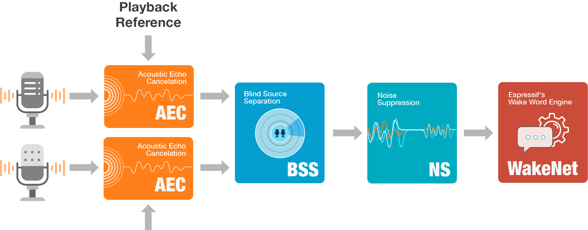
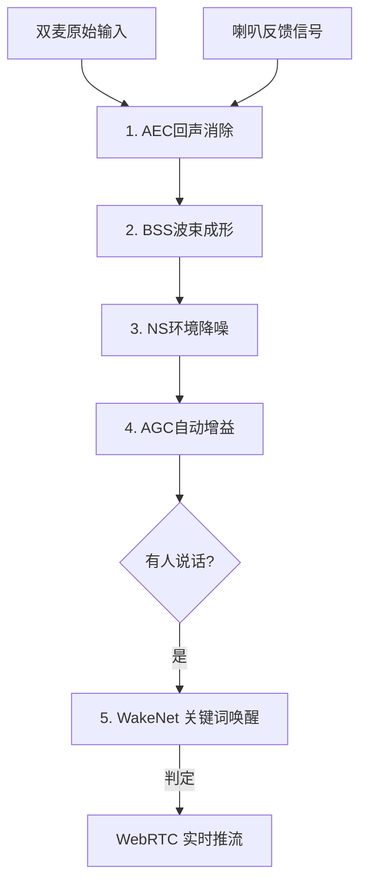

# 音频流水线与 Espressif AFE 指南 (Audio Pipeline & ESP-AFE)

针对 ESP32-S3-WROOM-1-N16R8 模组优化的音频前端处理方案。

## 1. 为什么 ESP-AFE 对本项目至关重要？

在 AI 玩具场景中，最难处理的是**“自说自话”**（喇叭发出的声音又被麦克风录进去了）。ESP-AFE 提供的 [AEC (回声消除)](https://www.espressif.com/zh-hans/solutions/audio-solutions/esp-afe) 算法能让 AI 服务器只听到用户的声音，而听不到 AI 自己的回声。

### N16R8 模组的优势：
- **AI 加速**：利用 S3 的指令集，AFE 算法的算力开销极低。
- **OPI 内存**：8MB Octal PSRAM 提供了足够的带宽来缓冲音频帧，防止在高带宽推流时产生爆音。

---

## 2. 音频流水线拓扑图 (Pipeline Topology)

为了让你更直观地理解 AFE 算法是如何在芯片内部工作的，乐鑫官方提供了一张标准的逻辑图：



### 软件流水线逻辑 (依照官方 AFE 级联顺序)

为了保证最高的识别率，流水线严格遵循以下**级联处理顺序**：



#### 流程节点解析：
1.  **AEC (第1关)**：强制剥离喇叭回声，这是“边播边听”的前提。
2.  **BSS (第2关)**：在纯净信号中锁定 0° 方向（正前方）的用户。
3.  **NS (第3关)**：滤除背景稳态噪音。
4.  **WakeNet (核心)**：最终的关键词判定是建立在上述四道“精过滤”基础之上的。

---

## 3. AFE 核心算法配置建议

为了达到最佳效果，建议在代码中开启以下功能：

- **AEC (Acoustic Echo Cancellation)**：回声消除。需额外接入一组 I2S 信号作为参考回声。
- **BSS (Blind Source Separation)**：双麦克风波束成形。能自动锁定公仔正前方 1-2 米的人声。
- **NS (Noise Suppression)**：环境背景噪声抑制（如风扇声、底噪）。
- **AGC (Automatic Gain Control)**：自动增益，防止用户离得太远听不清。

---

## 4. 本地 VAD (语音活动检测) 的深度作用

由于我们的 ASR 在云端，**本地 VAD** 是节省成本和提升响应速度的关键：

1.  **零无效推流**：只有本地 VAD 判定为人声时，ESP32 才开启 Opus 编码并向 LiveKit 发包。这意味着你的服务器在 80% 的静默时间内是不消耗带宽的。
2.  **ASR 切片参考**：本地 VAD 的“开始/结束”状态直接作为云端语音转文字的切片依据，减少了云端的计算压力。

### AFE 内部的 VAD 调优参数：
- `vad_mode`：可以设置为 0-3。数字越大，对人声越敏感，但在嘈杂环境下容易误触发。
- `vad_min_speech_ms`：最小说话时长阈值。比如设置为 200ms，可以过滤掉短暂的爆鸣声。
- `vad_min_noise_ms`：最小静默时长。用于判断用户是否真的说完了。

## 5. 固件实现细节 (C/C++ 代码思路)

### 4.1 AFE 初始化关键参数
```c
afe_config_t afe_config = AFE_CONFIG_DEFAULT();
afe_config.aec_init = true;         // 开启回声消除
afe_config.se_init = true;          // 开启语音增强 (BSS/NS)
afe_config.vad_init = true;         // 开启语音活动检测
afe_config.vad_mode = VAD_MODE_3;    // 最灵敏模式
```

### 4.2 内存分配注意
由于 AFE 算法占用内存较大（约 1MB），**必须**显式指定内存分配在 PSRAM 中：
```c
esp_afe_sr_iface_t *afe_handle = &ESP_AFE_SR_HANDLE;
afe_data_t *afe_data = afe_handle->create_from_config(&afe_config);
```

---

## 6. 软件 EQ 补偿方案 (Audio Equalization)

针对“后背出音”导致的物理高频衰减，必须在播音流水线中集成 **EQ 补偿**，以提升语音的明亮度和还原度。

### 6.1 补偿逻辑：High-Shelf 滤波
我们重点增强 **3.5kHz - 8kHz** 的频段，这是决定人声明亮感和咬字清晰度的关键区间。建议增益设定在 **+4dB ~ +6dB**。

### 6.2 ESP-ADF 代码实现示例
我们将 `equalizer` 插件插入 `opus_decoder` 和 `i2s_stream` 之间：

```c
// 定义 10 段 EQ 的增益 (单位: dB)
// 针对背部出音：重点提升最后三个频段 (高频部分)
int8_t back_speaker_eq_gains[] = {0, 0, 0, 0, 0, 0, 0, 2, 4, 6}; 

equalizer_cfg_t eq_cfg = DEFAULT_EQUALIZER_CONFIG();
eq_cfg.samplerate = 16000;
eq_cfg.channel = 1;
audio_element_handle_t eq_handle = equalizer_init(&eq_cfg);

equalizer_set_info(eq_handle, back_speaker_eq_gains);

// 将 EQ 链路加入播放 Pipeline
audio_pipeline_register(play_pipeline, eq_handle, "equalizer");
audio_pipeline_link(play_pipeline, (const char *[]) {"opus_dec", "equalizer", "i2s_write"}, 3);
```

---

## 7. 开发建议 (Tips)

1. **参考回声 (Reference Signal)**：本项目采用乐鑫官方推荐的**软件内部环回 (Software Loopback)** 方案。ADF 会自动在内存中将解码后的音频流复制一份给 AFE 算法，物理硬件上**不需要**额外接回馈线。
2. **麦克风间距**：硬件上两颗麦克风建议保持 **40mm - 65mm** 间距，这最符合 AFE 算法对双麦波束成形的最佳数学建模。
3. **性能测试**：在启用 AFE 后，建议通过串口监控打印系统的 CPU 占用，确保 S3 的两个核心（Core 0/1）负载平衡。
