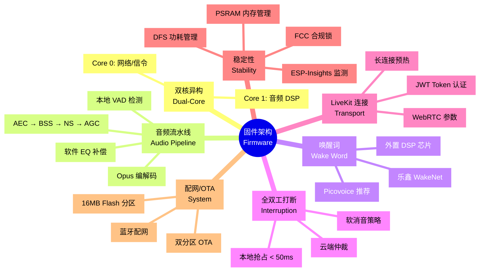

# 固件开发主文档 (Firmware Master Guide)

本项目固件不仅是一个音频播放器,更是一个**高并发、低延迟、拟人化的实时交互 OS**。我们的核心目标是在 ESP32-S3 有限的资源下,实现**媲美手机 App** 的流畅对话体验。



---

## 1. 核心设计哲学 (Design Philosophy)

**论点**：打造具备"灵魂"的 AI 公仔,而不是一个"智能喇叭"。

### 1.1 核心原则
- **实时性第一 (Real-time First)**：音频处理优先级高于一切。通过双核异构调度,确保 DSP 算法永不卡顿,端到端延迟 **< 500ms**。
- **边缘智能 (Edge Intelligence)**：唤醒词检测和打断逻辑完全在本地运行,不依赖云端,确保响应速度 **< 300ms**。
- **全双工 (Full Duplex)**：支持"边听边说",随时打断,拒绝"对讲机式"的轮询交互。

---

## 2. 系统架构深度解析 (System Architecture)

### 2.1 双核异构调度 (Dual-Core Scheduling)

ESP32-S3 拥有两个 Xtensa LX7 核心,我们对其进行了**严格的功能划分**,以避免音频破音(Glitch)和网络断连:

| 核心 | 任务分配 | 优先级 | 关键职责 |
| :--- | :--- | :--- | :--- |
| **Core 0 (PRO_CPU)** | **系统与信令** | High | 运行 Wi-Fi 协议栈、LwIP、LiveKit (WebRTC) 信令握手、OTA 下载。处理所有"慢速"IO 操作。 |
| **Core 1 (APP_CPU)** | **音频 DSP** | **Real-time** | **独占运行**。ESP-ADF 音频流水线：I2S 读取 → AEC 回声消除 → VAD 检测 → Opus 编码。 |

**关键决策**：**禁止在 Core 1 上运行任何阻塞性网络请求**(如 HTTP 握手),否则会导致正在播放的声音卡顿。

---

## 3. 音频流水线与 AFE (Audio Pipeline)

**文档概览：[Audio_Pipeline_and_AFE_Guide.md](./Audio_Pipeline_and_AFE_Guide.md)**

### 3.1 AFE 算法级联处理

为了保证最高的识别率,流水线严格遵循以下**级联处理顺序**:

```
双麦原始输入 + 喇叭反馈 
    ↓
1. AEC (回声消除) ← 这是"边播边听"的前提
    ↓
2. BSS (波束成形) ← 锁定 0° 方向(正前方)用户
    ↓
3. NS (环境降噪) ← 滤除背景稳态噪音
    ↓
4. AGC (自动增益) ← 防止用户离得太远听不清
    ↓
5. VAD (语音检测) ← 判定"有人说话?"
    ↓
6. WakeNet (唤醒) ← 关键词判定
    ↓
LiveKit (WebRTC 推流)
```

### 3.2 本地 VAD 的深度作用

由于 ASR 在云端,**本地 VAD** 是节省成本和提升响应速度的关键:

1. **零无效推流**：只有本地 VAD 判定为人声时,ESP32 才开启 Opus 编码并向 LiveKit 发包。这意味着服务器在 80% 的静默时间内不消耗带宽。
2. **ASR 切片参考**：本地 VAD 的"开始/结束"状态直接作为云端语音转文字的切片依据。

### 3.3 AFE 核心配置

```c
afe_config_t afe_config = AFE_CONFIG_DEFAULT();
afe_config.aec_init = true;         // 开启回声消除
afe_config.se_init = true;          // 开启语音增强 (BSS/NS)
afe_config.vad_init = true;         // 开启语音活动检测
afe_config.vad_mode = VAD_MODE_3;   // 最灵敏模式
```

**关键约束**：AFE 算法占用内存约 **1MB**,**必须显式分配在 PSRAM 中**。

### 3.4 软件 EQ 补偿 (音质优化)

针对"后背出音"导致的物理高频衰减,必须在播音流水线中集成 **EQ 补偿**:

- **补偿频段**：重点增强 **3.5kHz - 8kHz**(人声明亮感和咬字清晰度的关键区间)。
- **建议增益**：**+4dB ~ +6dB**。

---

## 4. 唤醒词方案 (Wake Word Solutions)

**文档概览：[Custom_Wake_Word_Solutions.md](./Custom_Wake_Word_Solutions.md)**

针对 "Hi, Trump!" 这一特定需求,我们有以下方案:

| 方案 | 实施速度 | BOM 成本 | 授权费 | 续航表现 | 适用规模 |
| :--- | :--- | :--- | :--- | :--- | :--- |
| **1. 乐鑫官方定制 (WakeNet)** | 🐌 慢 | 0 | 高 (NRE) | 一般 | > 10k 台 |
| **2. Picovoice Porcupine** [推荐] | 🚀 极快 | 0 | ~$1/台 | 一般 | 所有规模 |
| **3. 开源自训练 (Edge Impulse)** | 🌕 较慢 | 0 | 0 | 一般 | 技术团队 |
| **4. 外置芯片 (GX8002)** | 🌕 中 | +¥12 | 0 | **极佳** | 高续航需求 |

### 4.1 推荐方案：Picovoice (500 台首批)

**核心优势**：
- **纯离线运行**：唤醒判定完全在 ESP32 芯片内完成,无需实时连接云端,保护隐私且响应极快。
- **零门槛生成**：在网页控制台输入单词即可生成模型。
- **硬件指纹绑定**：同一块板子烧录 100 次,在后台依然只算作 **1 台**活跃设备。

**实操流程**：
1. 在 [Picovoice Console](https://console.picovoice.ai/) 输入 "Hi Trump",环境选 ESP32,生成并下载 `.ppn` 模型。
2. 将模型文件转换为 C 语言数组,配合 Porcupine lib 编译进固件。
3. 使用官网申请的 `AccessKey` 进行初始化。

### 4.2 高级方案：外置 DSP 芯片 (续航优先)

**适用场景**：产品定位为"全天候待机潮玩",且电池容量受限。

**优势**：
- **超低待机功耗**：专用芯片待机电流可低至 **uA 级别**。ESP32-S3 可进入深睡眠,仅在唤醒瞬间被外部中断点亮。
- **硬件级 AFE**：部分芯片集成硬件 AEC 和 Beamforming,拾音精度优于 ESP32 软件处理。

**代价**：BOM 成本增加约 **¥10-15**,PCB 布局增加复杂度。

---

## 5. 全双工与打断逻辑 (Full-Duplex Interruption)

**文档概览：[Full_Duplex_and_Interruption_Logic.md](./Full_Duplex_and_Interruption_Logic.md)**

实现"自然聊天"的核心在于:**AI 说话时也在听,且听到用户插话能立即反应。**

### 5.1 双重保障逻辑

| 逻辑层次 | 触发源 | 作用 | 优点 |
| :--- | :--- | :--- | :--- |
| **第一级：本地抢占** | ESP-AFE (VAD) | 本地检测到用户声音且能量极高时,先行静音喇叭 | **零延迟响应** (< 50ms)。公仔立刻"闭嘴",带给用户极强操控感。 |
| **第二级：云端仲裁** | LiveKit Agent | 根据语义和完整音频流判定是否打断 | **高准确度**。能区分"真的在说话"还是"打喷嚏"误报。 |

### 5.2 本地抢占核心代码逻辑

```c
// 伪代码：高频循环(每20ms一次)
while (1) {
    afe_fetch_result_t* res = afe_handle->fetch(afe_data);
    
    // 本地抢占判定：VAD有效 && 正在播音
    if (res->vad_state == VAD_SPEECH && global_state.is_ai_talking) {
        // --- 动作 A：快速刹车 (硬件级) ---
        i2s_zero_dma_buffer(SPK_I2S_PORT); 
        
        // --- 动作 B：业务锁定 ---
        global_state.interrupted_flag = true;
        
        // --- 动作 C：信令上报 ---
        livekit_send_interrupt_signal();
        
        // --- 动作 D：UI 反馈 ---
        led_set_state(STATE_LISTENING);
    }
}
```

### 5.3 避免"咔哒"声：软消音策略

直接清空缓冲区会导致电压骤降,产生爆音。需实现:
- **快速衰减**：在执行 `i2s_zero_dma_buffer` 前,将最后 128 个采样点(约 8ms)线性乘以 1.0 → 0.0 的系数。

---

## 6. LiveKit 连接与信令 (Transport)

**文档概览：[LiveKit_Transport_and_Signaling.md](./LiveKit_Transport_and_Signaling.md)**

### 6.1 安全认证流程

**严禁在固件中硬编码 Secret**。正确流程:

1. 设备端发起 HTTPS 请求到 App Server,提供 DeviceID。
2. App Server 验证设备合法性,生成 **JWT Access Token**。
3. App Server 返回 Token 和服务器 URL。
4. 设备端使用 Token 与 LiveKit 服务器握手。

### 6.2 连接策略：长连接预热

**推荐流程**：
1. **系统初始化**：Wi-Fi 连通后,立即在后台发起 Token 请求并调用 `livekit_room_connect()`。
2. **待机状态**：保持连接不掉线,但不开启麦克风采集。
3. **唤醒触发**：**瞬间**开启音频 Track 发布,延迟控制在 **< 200ms**。
4. **自动休眠**：若连续 300 秒无语音交互,则断开连接进入低功耗模式。

### 6.3 性能参数配置

```c
- 音频编码：Opus (LiveKit 默认)
- 采样率：16kHz (语音场景最佳平衡点)
- 位率：24kbps (足以承载自然语音)
- 帧长：20ms (降低端到端延迟)
```

---

## 7. 系统稳定性与调优 (Stability)

**文档概览：[System_Stability_and_Performance.md](./System_Stability_and_Performance.md)**

### 7.1 内存分配策略

**核心宏定义 (sdkconfig)**：
```c
CONFIG_SPIRAM_MALLOC_ALWAYS_INTERNAL=4096  // < 4KB → SRAM, > 4KB → PSRAM
CONFIG_BT_ALLOCATION_FROM_SPIRAM_FIRST=y   // 蓝牙协议栈优先 PSRAM
CONFIG_WIFI_LWIP_ALLOCATION_FROM_SPIRAM_FIRST=y  // Wi-Fi 堆栈也移向 PSRAM
```

**显式代码约束**：
```c
// LiveKit 大容量 Ringbuffer 申请 PSRAM
uint8_t *buf = heap_caps_malloc(8192, MALLOC_CAP_SPIRAM | MALLOC_CAP_8BIT);
```

### 7.2 功耗管理

使用官方 **自动频率缩放 (DFS)**:
```c
esp_pm_config_t pm_config = {
    .max_freq_mhz = 240,  // 满负载频率
    .min_freq_mhz = 80,   // 空闲时降频
    .light_sleep_enable = true
};
ESP_ERROR_CHECK(esp_pm_configure(&pm_config));
```

### 7.3 远程监测：ESP-Insights

500 台外测最担心"死机原因不明"。接入乐鑫官方 **ESP-Insights**:

**功能**：
- **崩溃分析**：设备重启后自动上传 Core Dump,后台直接看报错在哪一行代码。
- **指标监控**：PSRAM 剩余量、Wi-Fi RSSI、VAD 触发频率。
- **自定义事件**：记录每台设备每天被唤醒次数,用于产品迭代决策。

### 7.4 FCC 合规固件锁

针对出口美国的设备,固件层面必须施加**不可绕过的软件锁**:

```c
// 地区码锁定
esp_wifi_set_country("US");  // 严禁开启 Channel 12, 13, 14

// 发射功率限制
esp_wifi_set_max_tx_power(78);  // 19.5 dBm
```

---

## 8. 配网与 OTA 升级 (Provisioning & OTA)

**文档概览：[Provisioning_and_OTA_Guide.md](./Provisioning_and_OTA_Guide.md)**

### 8.1 蓝牙配网 (ESP-Provisioning over BLE)

**固件工作流程**：
1. 启动时检查 NVS 存储。若无 ssid 记录,自动进入配网模式。
2. 开启 BLE 广播,设备名格式为 `PROV_Spongebob_XXXX`。
3. 接收 App 通过 Protobuf 发送的加密 Wi-Fi 凭证。
4. 连接成功后,**彻底释放蓝牙内存** (`esp_bt_controller_deinit`)。

**关键**：**严禁在蓝牙配网时开启 LiveKit 或 AFE 任务**,否则会内存溢出。

### 8.2 双分区 OTA

采用 A/B 分区策略,确保升级失败不"变砖":
- `ota_0`：当前运行分区 (4MB)
- `ota_1`：待升级分区 (4MB)

**安全策略**：
- 电量低于 20% 时拒绝 OTA。
- 在用户对话时严禁触发 OTA,需等待深睡眠时自动重启。

---

## 9. Flash 分区表规划 (Partition Table)

**文档概览：[Flash_Partition_Table_Guide.md](./Flash_Partition_Table_Guide.md)**

针对 ESP32-S3-WROOM-1-N16R8 (16MB Flash),推荐分区表:

```csv
# Name,   Type, SubType, Offset,  Size
nvs,      data, nvs,     ,        0x10000
otadata,  data, ota,     ,        0x2000
phy_init, data, phy,     ,        0x1000
ota_0,    app,  ota_0,   ,        0x400000  (4MB)
ota_1,    app,  ota_1,   ,        0x400000  (4MB)
model,    data, spiffs,  ,        0x400000  (4MB，存 WakeNet 模型)
storage,  data, fat,     ,        0x3E0000  (3.8MB，存本地 MP3)
```

**关键设计**：
- **ota_0/ota_1 各 4MB**：为未来 3-5 年功能迭代预留空间。
- **model 独立分区**：更换唤醒词时,只需局部更新 Flash,无需全量 OTA。

---

## 10. 开发环境搭建 (Getting Started)

**文档概览：[Developer_Getting_Started_Guide.md](./Developer_Getting_Started_Guide.md)**

### 10.1 工具安装

1. **VS Code** + **Espressif IDF** 插件
2. **ESP-IDF v5.1.2**（稳定版本）
3. **ESP-ADF**：音频处理扩展库

### 10.2 验证安装

```bash
idf.py --version
# 应显示：ESP-IDF v5.1.2
```

### 10.3 运行第一个程序

1. 导入示例：`ESP-ADF → get-started/play_mp3`
2. 编译：点击底部工具栏"齿轮"图标 (Build)
3. 烧录：点击"闪电"图标 (Flash)
4. 监控：点击"小显示器"图标 (Monitor)

**成功标志**：终端滚过调试信息,板子喇叭传出音乐！

---

## 11. 核心避坑准则 (Best Practices)

1. **内存管理**：所有 > 4KB 的 Buffer 必须使用 PSRAM (`MALLOC_CAP_SPIRAM`)。
2. **分时隔离**：配网时关音频,音频时关蓝牙,这是保证 S3 不死机的金科玉律。
3. **看门狗策略**：永远不要在主循环里阻塞超过 10 秒,善用官方 TWDT。
4. **远程诊断**：500 台外测必须开启 ESP-Insights。
5. **I2S DMA 缓冲区严禁放在 PSRAM**：确保 `CONFIG_I2S_ISR_IRAM_SAFE` 开启。
