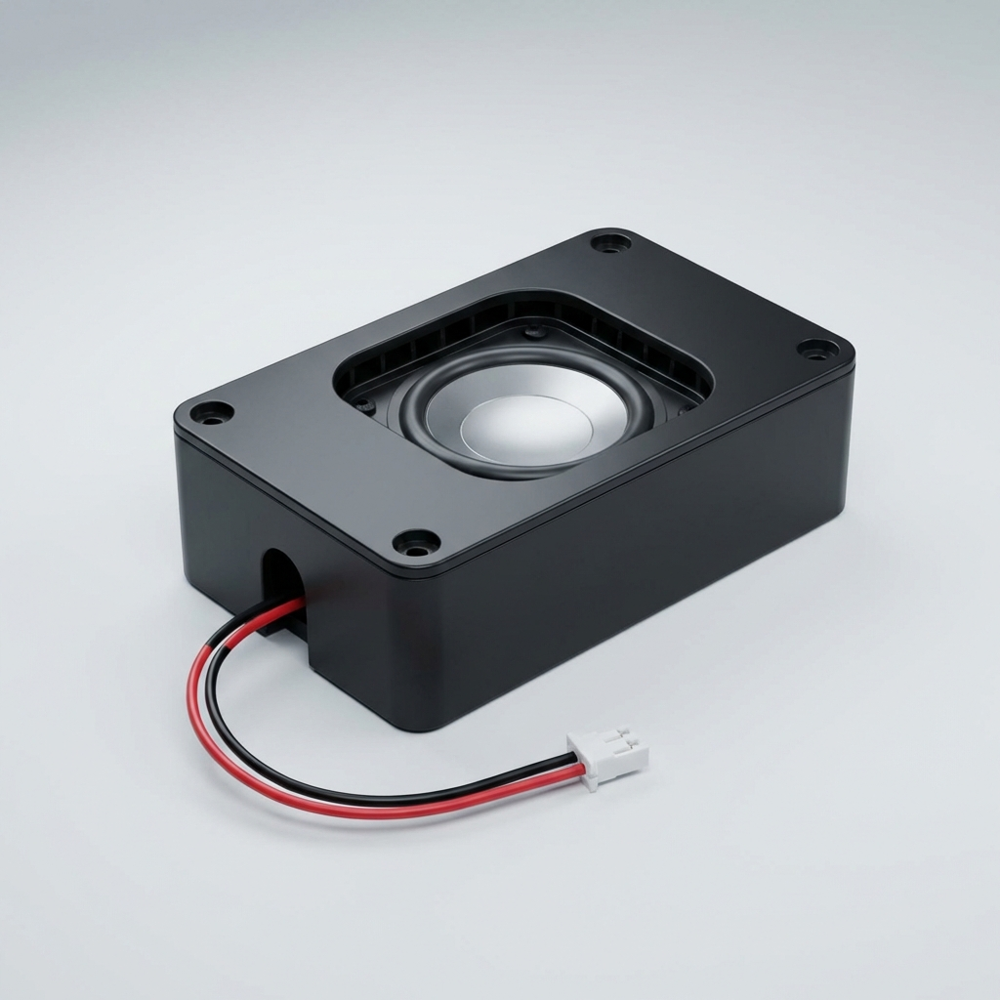

# 语音玩具音质进阶：I2S 功放与喇叭选型指南

要让名人不仅仅是“说话”，而是“好听”，我们需要在硬件上处理好音频输出链。

## 1. 为什么选择 I2S 功放 (以 MAX98357A 为例)

### 1.1 工作原理对比
- **传统 PWM 功放**：通过调整占空比模拟声音，底噪大，对高频支持差。
- **I2S 功放**：通过 I2S 数字协议接收音频流，芯片内部完成 DAC 和信号放大。

### 1.2 核心优势
- **极简电路**：不需要外部滤波器，只需引出 5 根线接到 ESP32。
- **高效率**：Class D 放大，电池电量更多地转化成声音，而不是热量。
- **防噪音**：由于全程数字流，不怕玩具内部复杂的电磁环境干扰。

## 2. 喇叭 (Speaker) 深度选型建议

针对 4Ω 3W 这个规格，我们需要进一步细化以下参数：

### 2.1 物理形态
- **圆形 (Circular)**：如直径 30mm/40mm。声音扩散均匀，最常见。
- **跑道型 (Oval)**：如 20mm x 40mm。适合海绵宝宝这种扁平的身体，能在节省空间的同时保证震动面积。

### 2.2 声音表现（名人语音还原）
- **人声优先**：选择 **Fo (谐振频率)** 适中的喇叭。太高会显得声音单薄刺耳。
- **内磁避雷**：**强烈建议选择内磁喇叭**。
    - **优点**：体积小，磁场不外泄，不会干扰旁边的 Wi-Fi 天线或电路。

### 2.3 接口选择
- **自带导线 + 插件**：量产时直接插在 PCB 上的插座里，不需要人工去焊，效率高，返修易。

### 2.4 推荐形式：一体化模组喇叭 (Box Speaker)
对于 100-500 台规模的试产，强烈建议采购**自带密封音腔**的成品模组。这种模组将喇叭单元密封在一个 ABS 塑料盒内，无需额外进行复杂的声学设计。

*图：典型的 IoT 一体化腔体喇叭模组（自带 PH2.0 接口）*

## 3. 声学结构设计 (关键)

**切记：没有音腔就没有音质。**

### 3.1 独立音腔 (Sealed Chamber)
- 在海绵宝宝内部，必须给喇叭做一个**独立的、密封的小空间**。
- 如果喇叭和电路板在一个大空间里，低音会消失，且声音会通过空气反传给麦克风造成“回啸”。

### 3.2 声音出口设计
- 声音孔总面积应不小于喇叭震动面积的 **1/3**。
- 开孔位置建议在海绵宝宝侧面或底部，避免被用户的手心完全捂死。

## 4. 选型 Checklist (待定决策)
- [ ] 测量海绵宝宝内部最大可容纳喇叭的 **直径与厚度**。
- [ ] 确定喇叭安装方式：热熔柱固定、螺丝固定还是卡扣固定？
- [ ] 决定是否采用带有预装音腔盒的“一体化模组喇叭”（深圳供应链有很多现成的）。

---
**小知识：4Ω 还是 8Ω？**
- **4Ω**：在相同电压下声音更大，适合电池供电。
- **8Ω**：音质通常更细腻，但声音较轻。对于玩具，推荐 **4Ω**。
