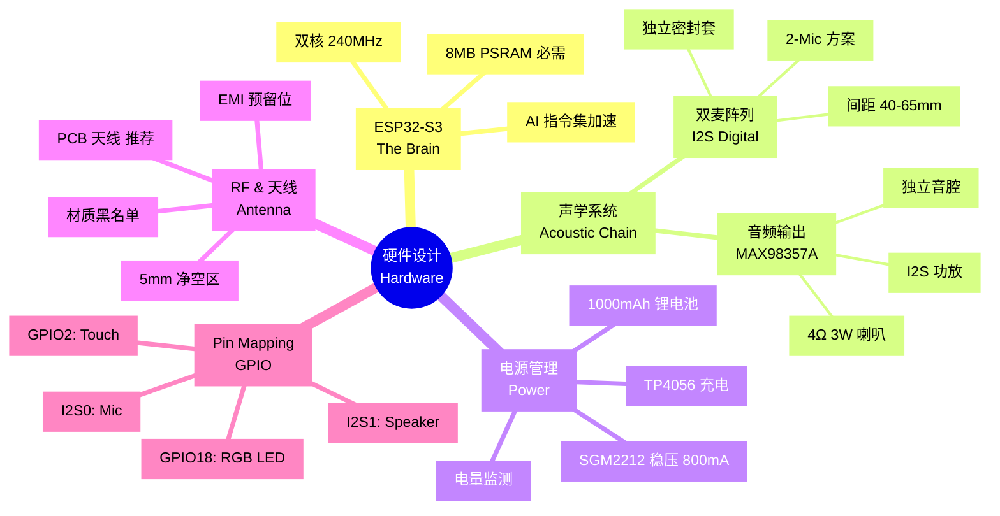

# 硬件设计主文档 (Hardware Design Master Guide)

本项目硬件设计的核心目标是：在 **< ¥200 (CNY)** 的 BOM 成本约束下，构建一个通过 FCC 认证、声学性能达标的 AIoT 语音终端。

如果您不具备复杂的射频与声学设计经验，请严格遵循本指南的选型与布局建议，避免"听不清、连不上、充不进"三大硬件天坑。

---

## 1. 核心选型与理由 (Component Selection)

### 1.1 主控芯片：ESP32-S3 (The Brain)

**型号**：`ESP32-S3-WROOM-1-N16R8`

**为什么必须是 S3？**
- **AI 指令集加速**：S3 是乐鑫首款支持 AI 向量加速的芯片，WakeNet 唤醒词推理速度比 ESP32 原版**快 10 倍**。
- **8MB PSRAM 必需**：LiveKit WebRTC 协议栈和 Opus 编解码器需要至少 4MB 的动态内存。S3 的 Octal PSRAM 提供了足够的带宽，内部 SRAM 仅不足 400KB，音频 Buffer 必须存储在 PSRAM。
- **双核异构**：Core 0 处理网络/信令，Core 1 独占音频 DSP，确保实时性。

**避坑警告**：
> **严禁使用不带 PSRAM 的 C3/S2 系列**。ESP32-C3 虽然便宜（约¥10），但：
> - **算力不足**：单核 160MHz，无法同时支撑 Wi-Fi 协议栈和软件 AEC 算法，会导致"无法打断"的对讲机体验。
> - **内存缺失**：C3 通常不支持大容量 PSRAM，无法容纳几秒钟的音频丢包重传缓冲区，导致声音卡顿。
> - **结论**：C3 仅适合智能开关/插座；**对于实时语音 AI 玩具，ESP32-S3 是最低门槛**。

---

## 2. 声学链路设计 (Acoustic Chain)

### 2.1 麦克风阵列：双麦 I2S 方案 (The Ears)

**文档概览：[Microphone_and_AFE_Guide.md](./Microphone_and_AFE_Guide.md)**

**核心决策：为什么选 2-Mic（双麦）？**

| 维度 | 1-Mic (单麦) | **2-Mic (双麦)** [最优选] | 3-Mic (Korvo 阵列) |
| :--- | :--- | :--- | :--- |
| **抗噪能力** | 弱 | **强 (可过滤非目标方向人声)** | 极强 (调试极难) |
| **AEC 效果** | 基础级 | **进阶级 (更干净)** | 专业级 |
| **算力开销** | 极低 | 中等 (S3完美适配) | 极高 (挤占 WebRTC) |
| **结构难度** | 简单 | 中等 (需保证间距) | 复杂 (三孔对齐) |
| **用户场景** | 近距离手持 | **1.5米内桌面放置** | 远场 (3米+) 音箱 |

**具体型号推荐**：
- `MSM261S4030H0` (性能稳定，供应链成熟)
- **配对要求 (Matched Pair)**：灵敏度差值 **< ±1.0 dB**，相位差 **< 5°**，这对 2-Mic AFE 算法的收敛速度至关重要。

**为什么选数字麦 (I2S)？**
- 传统模拟驻极体麦克风极其容易受 Wi-Fi 射频干扰（滋滋声）。**全数字链路从源头切断干扰**，底噪极低。
- 免去外部 ADC 芯片，简化电路，降低成本。

**关键参数**：
- **信噪比 (SNR)**: ≥ 64 dB（保证轻声说话时的纯度）
- **声过载点 (AOP)**: ≥ 120 dB SPL（防止近距离大声说话时削波）
- **工作电流**: < 1 mA（满足低功耗待机）

**硬件布局要求**：
- **间距**：两颗麦克风中心轴距固定在 **40mm - 65mm**。
- **方向**：双麦轴线应水平，正对用户脸部。
- **密封性 (核心)**：**每颗麦克风必须有独立密封硅胶套**，严禁在玩具内部共享空气腔。否则喇叭声音会通过空气传播到麦克风，导致 AEC 算法失效。

---

### 2.2 音频功放：MAX98357A (The Mouth)

**文档概览：[Audio_Output_and_Speaker_Guide.md](./Audio_Output_and_Speaker_Guide.md)**

**为什么选 I2S 功放？**
- **数字直驱**：直接接收 ESP32 的 I2S 数字音频，无需外挂 DAC。
- **极简电路**：不需要外部滤波器，只需 5 根线连接。
- **D 类高效**：效率高，发热小，不需要专门散热片。
- **防噪音**：全程数字流，不怕玩具内部复杂的电磁环境干扰。

**喇叭搭配**：
- **推荐规格**：**4Ω 3W** 全频喇叭
- **形态选择**：
  - **圆形**（如 30mm/40mm）：声音扩散均匀。
  - **跑道型**（20mm x 40mm）：适合扁平结构，节省空间。
- **内磁优先**：**强烈建议选择内磁喇叭**，磁场不外泄，不会干扰 Wi-Fi 天线或电路。

**一体化模组喇叭 (推荐)**：
对于 100-500 台规模试产，强烈建议采购**自带密封音腔**的成品模组（如 3020 音腔喇叭）。无需额外进行复杂的声学设计，直接使用。

**声学结构关键**：
- **独立音腔 (Sealed Chamber)**：喇叭必须有独立、密封的小空间。否则低音会消失，声音会通过空气反传给麦克风造成"回啸"。
- **出音孔设计**：总面积不小于喇叭震动面积的 **1/3**，位置建议在侧面或底部，避免被手心完全捂死。

---

## 3. 电源与电池管理 (Power System)

**文档概览：[Power_and_Battery_Management.md](./Power_and_Battery_Management.md)**

### 3.1 功耗预算 (Power Budget)

| 工作模式 | 电流消耗 (3.7V) | 备注 |
| :--- | :--- | :--- |
| **持续对话** (Wi-Fi + AFE + Opus + 喇叭) | 180mA - 250mA | 平均值 |
| **浅睡眠** (Wi-Fi保持+监听唤醒词) | 50mA - 80mA | 待机模式 |
| **深度睡眠** (等待物理按键) | < 20uA | 微安级 |

### 3.2 电池选型

**推荐容量：1000mAh**
- **续航**：持续通话约 **4.5 小时**。
- **物理规格**：型号 `603450`（厚 6.0mm x 宽 34mm x 长 50mm）。
- **设计预留**：按 **7.0mm x 36mm x 52mm** 开孔（预留 1-2mm 充放电胀气空间）。

**安全要求**：
- 必须带 **双重保护板 (PCM)**，防止过充、过放和短路。
- 使用 **PH 2.0 插件** 连接，不要直接焊在 PCB 上（量产和维修极难操作）。

### 3.3 充电电路：TP4056

- **充电电流设定**：$I_{chg}(mA) \approx \frac{1200}{R_{prog}(k\Omega)}$
- **推荐配置**：$R_{prog} = 1.5k\Omega$，对应充电电流约 **800mA**（平衡寿命与发热）。
- **指示灯**：预留红灯（充电中）/ 绿灯（充满）双色指示。

### 3.4 稳压方案：SGM2212-3.3 (或 800mA+ LDO)

**为什么需要大电流 LDO？**
- ESP32-S3 在 Wi-Fi 传输 + 音频功放工作时，峰值电流可达 **500mA-600mA**。300mA 级别的 LDO 会导致系统在高负载下频繁死机或重启。

**关键设计**：
- **输出能力**：额定 **800mA** 持续输出。
- **Layout 建议**：
  - LDO 输入端：1uF + 10uF 组合。
  - LDO 输出端（紧贴模组 3V3）：**22uF 陶瓷电容**（这是解决 Wi-Fi 掉线和系统复位的首要手段）。

### 3.5 电量监测

- **电路方案**：高阻值分压法（$R_{up} = 100k\Omega$，$R_{down} = 100k\Omega$，精度 $\pm 1\%$）。
- **软件处理**：ADC 采样值乘 2 得到实际电池电压。当电压降至 **3.4V** 时，触发低电提示（如"我有点累了，帮我充个电吧"）。

---

## 4. 射频与天线设计 (RF & Antenna)

**文档概览：[Antenna_Selection_Guide.md](./Antenna_Selection_Guide.md)**

### 4.1 方案对比：PCB 天线 vs. IPEX 外部天线

| 特性 | **PCB 天线 (WROOM-1)** [推荐] | IPEX 外部天线 (WROOM-1U) |
| :--- | :--- | :--- |
| **成本** | $0 (包含在模组内) | +¥1-2 (额外采购) |
| **组装** | 无需组装 | 需人工扣合，跌落可能脱落 |
| **性能** | 良好 (取决于布局) | 优秀 (可避开障碍物) |
| **适用场景** | 空间充足、外壳非金属 | PCB被深埋、信号要求高 |

**选型建议**：
1. **初期原型**：使用 **PCB 天线**版本（Korvo-1 即为 PCB 天线）。
2. **ID 定稿阶段**：
   - 如果 PCB 距外壳 **< 5mm** 且周围空旷：坚持 **WROOM-1 (板载)**。
   - 如果 **> 10mm** 且中间有障碍物：改为 **WROOM-1U (IPEX)**。
3. **测试标准**：装好所有零件后，用手机热点测试 RSSI。若 RSSI 低于 **-70dBm**，必须更换外部天线。

### 4.2 设计红线 (Design for FCC)

**净空区 (Keep-out Area)**：
- 模组 PCB 天线投影区域及向外延伸 **5mm** 范围内：
  - **严禁铺铜、严禁走线、严禁打过孔**。
  - **严禁放置**：电池、喇叭（含磁铁）、金属件、人手接触区。

**材质黑名单**：
- **金属漆/真空电镀**：形成"法拉第笼"，阻断 Wi-Fi。
- **导电橡胶**：部分黑色橡胶可能导电。
- **过厚外壳**：建议控制在 **3.0mm** 以内。

**EMI 预留位**：
- USB D+/D- 差分线上预留 **共模电感 (0402)** 焊盘（90Ω @ 100MHz）。若 EMC 测试超标，焊上该电感通常能"救命"。

---

## 5. 引脚分配 (Pin Mapping)

**文档概览：[Pin_Mapping_Guide.md](./Pin_Mapping_Guide.md)**

| 类别 | 信号 | GPIO | 功能说明 |
| :--- | :--- | :--- | :--- |
| **音频输入** | I2S_M_WS | **GPIO 4** | 麦克风左右声道切换 |
| | I2S_M_SCK | **GPIO 5** | 麦克风时钟信号 |
| | I2S_M_DATA | **GPIO 6** | 麦克风数据输入 |
| **音频输出** | I2S_A_WS | **GPIO 15** | 功放采样切换 (LRCK) |
| | I2S_A_SCK | **GPIO 16** | 功放串行时钟 (BCLK) |
| | I2S_A_DATA | **GPIO 17** | 功放数据输出 (DOUT) |
| **交互反馈** | RGB_DATA | **GPIO 18** | WS2812B 全彩灯珠 |
| | TOUCH_PAD | **GPIO 2** | 触摸唤醒 |
| **电源监测** | BAT_ADC | **GPIO 1** | 电池电压监测 |
| **系统** | USB_D+ | **GPIO 20** | 原生 USB 烧写 |
| | USB_D- | **GPIO 19** | 原生 USB 烧写 |

**严禁占用**：
- **GPIO 26 ~ 37**（被 Flash 和 PSRAM 占用）

**设计要点**：
1. **AEC 回声消除**：采用"软件内部环回"方案，**硬件上不需要**从功放引回任何信号线。
2. **I2S 走线**：长度尽量相等，远离 Wi-Fi 天线。
3. **USB 阻抗**：GPIO 19/20 差分线走 **90 欧姆阻抗控制**。
4. **ESD 防护**：USB 接口路径必须增加 ESD 保护二极管（如 SRV05-4）。

---

## 6. 新手入门路径 (Beginner's Guide)

**文档概览：[Getting_Started_for_Beginners.md](./Getting_Started_for_Beginners.md)**

如果您是硬件小白，推荐使用 **嘉立创 EDA 专业版**：
1. **一键开路**：设计 + 买零件 (LCSC) + 打板 (JLC) 全部打通。
2. **元件库**：搜索 `C467406` (ESP32-S3 模组)，自动带出准确封装。

**设计三步走**：
1. **原理图 (Schematic)**：按照 `Pin_Mapping_Guide.md` 连接引脚。
2. **PCB 布局 (Layout)**：板框 **35mm x 55mm**，建议 **4 层板**（信号稳定，怎么画都不易出错）。
3. **一键下单 (PCBA)**：选择"PCBA 先进产线"，拿到手就是能开机的成板。

**新手忠告**：
1. **天线不要遮挡**：模组天线部分伸出板外，或下方所有层"开窗"不铺铜。
2. **电源线画粗**：3.3V/5V 线宽 **15-20mil**，信号线 **6-8mil**。
3. **电容靠近引脚**：0.1uF 小电容必须紧贴芯片电源引脚。

---

## 7. 总结与检查清单

- [ ] 确认使用 **ESP32-S3-WROOM-1-N16R8**（带 8MB PSRAM）。
- [ ] 确认使用 **I2S 数字麦克风** x2，间距 40-65mm，独立密封。
- [ ] 确认使用 **MAX98357A + 4Ω 3W 喇叭**，独立音腔设计。
- [ ] 确认 **TP4056 充电** + **SGM2212-3.3 稳压**，输出端 22uF 电容。
- [ ] 确认天线周围 **5mm 净空区**，无铜、无线、无金属。
- [ ] 确认 USB D+/D- 预留 **共模电感焊盘**。
