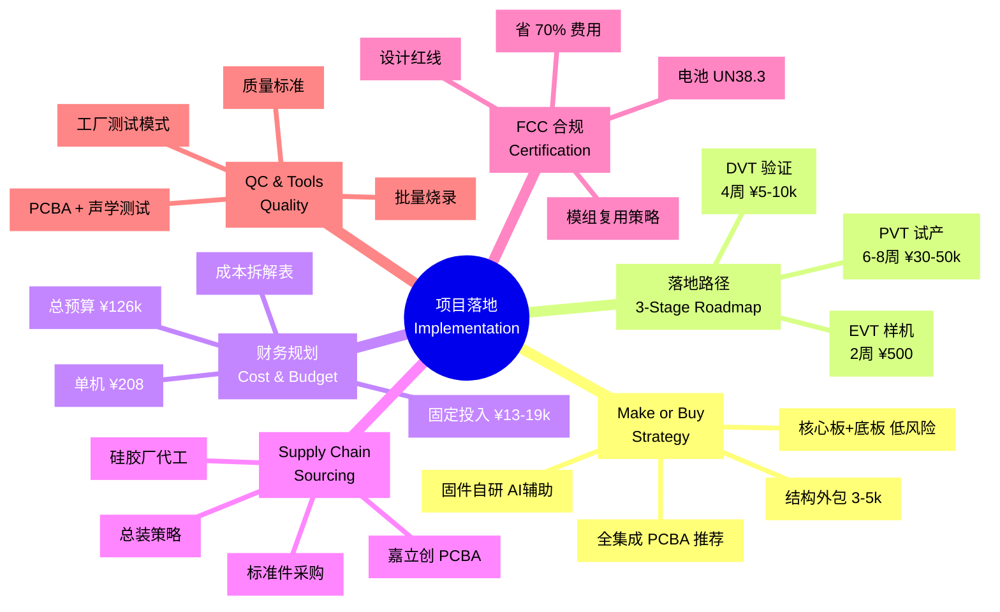

# 项目落地与实施主文档 (Implementation Master Guide)

本章节将纸面设计转化为实体产品。我们将指导您从零经验起步，逐步打通深圳供应链，完成从 EVT (工程样机) 到 500 台小批量试产的全过程。

---

## 1. 核心策略：自己做 vs. 外包 (Make or Buy Strategy)

**文档概览：[Implementation_Roadmap.md](./Implementation_Roadmap.md)**

基于 500 台试产规模，我们的核心策略是"**模块化分工** + **关键环节直控**"：

### 1.1 硬件 (EE)
您有两种选择：

**方案 A (推荐)：全集成 PCBA**
- **操作**：利用"嘉立创 EDA"克隆原理图，直接制作一块集成所有功能的主板。
- **优点**：成本最低（约 ¥35-40/台），集成度最高，无需设计复杂的接口。
- **劣势**：需要自己处理射频调试，有一定技术风险。

**方案 B (低风险)：核心板 + 底板架构**
- **操作**：采购成品开发板（如启明云端 WT9932S3-NANO, ¥46）+ 自研音频电源底板。
- **优点**：**直接豁免 RF 射频调试**，天线性能有保障。量产烧录方便（板载 USB）。
- **劣势**：每台成本增加约 ¥25-30，需解决电池充电管理和结构堆叠限制。
- **隐藏成本节省**：虽然物料贵 ¥12,500 (500台)，但省下约 ¥25,000 的 NRE (射频调试费)。

**我们的建议**：如果您是硬件初学者且风险承受能力低，强烈推荐方案 B。用小钱买"安心"。

### 1.2 结构 (MD) 
**外包**给"小设计工作室"或自由职业工程师。
- **途径**：闲鱼、硬派、猪八戒等平台。
- **费用**：¥3,000 - ¥5,000。
- **交付物**：3D .stp 文件 + 工程图纸。
- **关键**：务必提供我们准备的 [设计师协作包](./MD_Designer_Collaboration_Package.md)，避免反复沟通浪费时间。

### 1.3 固件 (FW)
**自己做**（AI 辅助）。基于 ESP-ADF 框架集成您已有的 LiveKit 软件。

---

## 2. 三步走落地路径 (Three-Stage Roadmap)

**文档概览：[Implementation_Roadmap.md](./Implementation_Roadmap.md)**

### 第一阶段：功能验证机 (EVT - Engineering Verification)
**目标**：证明"能响、能听"。

**动作清单**：
1. 购买 ESP32-S3-Korvo-1 开发板（约 ¥260）。
2. 在淘宝购买 3D 打印粗糙外壳（约 ¥50）。
3. 连接您现有的 LiveKit 软件，验证全双工通话功能。
4. 测试背部出音音质，确认声学设计可行。

**周期**：2 周  
**预算**：¥500 以内

### 第二阶段：设计验证 (DVT - Design Verification)
**目标**：证明"装得上、产得出"。

**动作清单**：
1. 找结构师完成 3D 建模 → 找模具厂开"真空复模"（无需开钢模）。
2. 制作第一版"母女板"PCBA，由嘉立创完成 SMT 贴片。
3. 组装 5-10 套高精度样机，验证装配公差与手感。
4. 进行声学密封测试，确保麦克风隔音达标。

**周期**：4 周  
**预算**：¥5,000 - ¥10,000

### 第三阶段：小批量产 (PVT - Production Verification)
**目标**：跑通生产线，验证良率。

**动作清单**：
1. 开**铝模**（成本仅为钢模的 1/5）生产硅胶外壳。
2. 联系深圳宝安/沙井的小型硅胶加工商进行总装。
3. 建立产线测试工位（PCBA 电测 + 声学扫频 + Wi-Fi 信号）。
4. 抽检老化测试（24 小时连续播放 + 跌落实验）。

**周期**：6-8 周  
**预算**：¥30,000 - ¥50,000

---

## 3. 成本控制与财务规划 (Cost & Budget)

**文档概览：[Cost_Analysis_and_Budget.md](./Cost_Analysis_and_Budget.md) | [Product_BOM_List.md](./Product_BOM_List.md)**

### 3.1 单机 BOM 成本：¥208 (CNY)

| 模块 | 项目 | 预估成本 | 占比 |
| :--- | :--- | :--- | :--- |
| **电子大脑** | ESP32-S3, 功放, 麦克风, 电源IC | ¥75 | 36% |
| **电路加工** | 4层PCB, SMT贴片, 治具费分摊 | ¥40 | 19% |
| **声学动力** | 1500mAh电池, 3020音腔喇叭, FPC | ¥30 | 15% |
| **外观壳体** | 硬质硅胶蒙皮, PC+ABS内胆 | ¥45 | 21% |
| **包装附件** | 彩盒, 说明书, Type-C线 | ¥18 | 9% |
| **合计** | | **¥208** | 100% |

### 3.2 前期固定投入 (NRE)：¥13,000 - ¥19,000

- 结构设计服务费：¥3,000 - ¥5,000
- 硅胶铝模费：¥8,000 - ¥12,000
- PCB 网板/治具：¥600
- 打样费（3D打印+板拔）：¥1,500

### 3.3 首批 500 台总预算

- **物料采购**：¥208 × 500 = ¥104,000
- **固定投入**：¥16,000
- **不可预见支出 (5%)**：¥6,000

**启动总预算建议：¥126,000 (约 13 万人民币)**

---

## 4. 供应链寻源策略 (Supply Chain Sourcing)

**文档概览：[Supply_Chain_Sourcing_Guide.md](./Supply_Chain_Sourcing_Guide.md)**

### 4.1 为什么不选"一站式集成商"？

1. **NRE 陷阱**：方案商往往要求 3-5 万研发费，而我们的 ESP32-S3 方案逻辑简单，不值得支付。
2. **供应链黑盒**：为降本可能克扣电池、音频芯片质量，导致口碑崩坏。
3. **响应速度慢**：小单得不到排产，自己通过嘉立创下单 5 天即可出货。

### 4.2 供应链角色分布

| 环节 | 合作对象 | 交付核心 | 获取途径 |
| :--- | :--- | :--- | :--- |
| **PCBA** | 专业打样厂 | 焊好的电路板 | 嘉立创、PCBWay、捷配 |
| **硅胶外壳** | 硅胶模具厂 | 符合公差的蒙皮 | 1688 搜"硅胶开模定制" |
| **塑料支架** | 3D 打印厂 | 内部骨架 | 未来工场、三维猴 |
| **标准件** | 代理商 | 电池、喇叭、FPC | 淘宝(散样)、1688(大货) |
| **总装** | 硅胶厂代工 | 成品玩具 | 实地考察生产线 |

### 4.3 总装策略

**推荐方案**：寻找"具有后端服务能力"的硅胶厂
- **流程**：寄给他们 PCBA 和电池 → 生产硅胶壳 → 现场完成内胆嵌入 → 封口 → 装入礼盒。
- **优点**：物流成本低，责任明确。

---

## 5. FCC 认证与出口合规 (Certification)

**文档概览：[FCC_Certification_Guide.md](./FCC_Certification_Guide.md)**

### 5.1 核心策略：模组复用 (Module Reuse)

ESP32-S3-WROOM-1 模组已通过 FCC 认证。我们采用"**复用原厂 ID**"策略：

**操作步骤**：
1. 在产品后盖标签标注：`Contains FCC ID: 2AC7Z-ESPS3WROOM1`。
2. 向实验室申请 **FCC Part 15C (RSE Only)** 测试，仅验证装入外壳后的辐射杂散。

**成本对比**：

| 方案 | 测试项目 | 费用 | 周期 |
| :--- | :--- | :--- | :--- |
| **自主设计射频** | 全套 (传导+辐射+跳频) | ¥35,000 - ¥50,000 | 4-6 周 |
| **模组复用** | **仅辐射杂散** | **¥6,000 - ¥9,000** | **2 周** |

**结论**：**立省 70% 费用**，缩短 1 个月周期。

### 5.2 设计红线 (Design Checklist)

**硬件**：
- [ ] 模组天线区及向外延伸 5mm 范围内**严禁铺铜、走线、放金属件**。
- [ ] USB D+/D- 差分线上预留**共模电感焊盘** (90Ω @ 100MHz)。
- [ ] 模组 3.3V 供电引脚旁放置 **10uF + 0.1uF 陶瓷电容**。

**固件**：
- [ ] 调用 `esp_wifi_set_country("US")` 锁定国家码，**严禁开启 Channel 12-14**。
- [ ] 限制最大发射功率 ≤ 78 (19.5dBm)。

### 5.3 电池运输认证 (UN38.3)

锂电池必须有 **UN38.3 测试报告** 和 **MSDS**，否则无法空运/海运。

**策略**：**直接采购已有证书的电芯**，不要自己做（费用 ¥5,000+，耗时 1 个月）。

---

## 6. 质量控制与生产工具 (QC & Production)

**文档概览：[Quality_Control_and_Testing.md](./Quality_Control_and_Testing.md) | [Factory_Production_Tools.md](./Factory_Production_Tools.md)**

### 6.1 产线测试工位

**工位 A：PCBA 功能电测**
- 供电电压 3.3V ± 0.1V
- 充电电流符合设计值 (500mA)
- 蓝牙/Wi-Fi 搜号正常

**工位 B：声学密封性测试**
- **扫频测试**：播放 20Hz - 20kHz，监听结构共振。
- **AEC 验证**：最大音量播放时喊唤醒词，测试打断成功率。
- **底噪检测**：静室环境录音信噪比检测。

### 6.2 关键质量标准

| 测试项目 | 判定标准 |
| :--- | :--- |
| **外观** | 硅胶溢料 < 0.2mm，无黑点/异色 |
| **按键手感** | 触发力 3N ± 1N，回弹干脆 |
| **Wi-Fi 信号** | 5 米 RSSI > -65dBm |
| **续航** | 抽检 5%，偏差 < 10% |

### 6.3 批量烧录方案

**量产期 (500台)**：
- **治具设计**：主板预留 4 个弹簧探针测试点 (TX, RX, IO0, GND)。
- **烧录器**：使用"一拖四"或"一拖八"离线烧录器，插上即烧。

**工厂测试模式**：
- **触发**：开机时连按隐藏键 5 次。
- **自检**：LED 轮流显示红/绿/蓝，自动播放音频，录音回放。
- **目的**：工人 10 秒判定合格品。

---

## 7. 设计师协作包 (Designer Collaboration)

**文档概览：[MD_Designer_Collaboration_Package.md](./MD_Designer_Collaboration_Package.md)**

如果您需要外包结构设计，我们准备了标准的**任务书 (Design Brief)**，包含：

### 7.1 核心组件清单

| 零件 | 型号 | 3D 建模要点 |
| :--- | :--- | :--- |
| **主控模组** | ESP32-S3-WROOM-1 | 必须保留天线区 5mm 净空 |
| **喇叭模组** | 3020 一体化音腔 | 出音孔与支架开口对齐 |
| **锂电池** | 103048 软包 (1500mAh) | 预留膨胀空间 0.5mm |
| **轻触按键** | 3x4x2.5mm 贴片式 | 与背部传力柱轴向对齐 |

### 7.2 关键约束

- **走线槽**：支架两侧必须设计宽 2.5mm、深 1.5mm 的走线槽。
- **电池仓**：全包围设计 + 四周 0.5mm EVA 泡棉。
- **拔模斜度**：所有垂直面需 0.5° - 1.0° 拔模斜度。
- **壁厚**：支架壁厚 1.5mm，加固筋 ≤ 0.8mm。

---

## 8. 即刻启动清单 (Action Plan)

- [ ] **Action 1**：注册嘉立创账号，熟悉"嘉立创 EDA"。
- [ ] **Action 2**：在 B 站搜索"ESP32-S3 音频开发板入门"，购买第一块板子。
- [ ] **Action 3**：准备《3D 建模任务书》，联系 3 位以上结构工程师询价。
- [ ] **Action 4**：锁定第一笔 1-2 万元研发/打样预算。

**结论：本项目实施方案已具备全闭环落地能力，可立即启动。**
