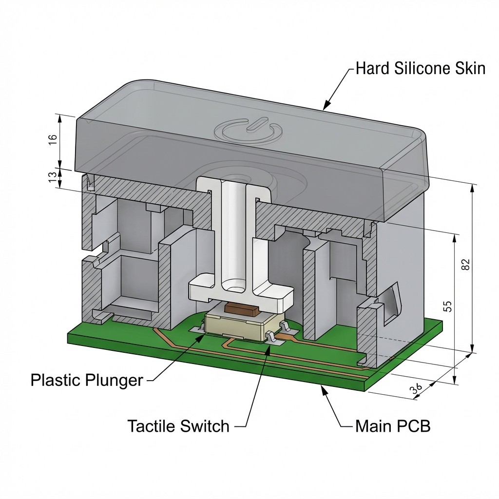

# 材质交互与表面工艺指南 (Materials & ID Interaction)

本章节定义公仔的“皮肤”质感、灯光表现及触觉反馈细节。

---

## 1. 核心材质定义 (Housing Materials)

### 1.1 主体选材：硬质硅胶 (60-70 Shore A)
- **硬度建议**：采用 **70度 高抗撕硅胶**。既能保持“双瓣”造型不塌陷，又能提供扎实的手感。
- **表面处理**：喷涂 **哑光手感油 (Skin-feel Oil)**。要求：抗静电等级达到电学防护标准，减少灰尘吸附。

### 1.2 导光设计：半透明匀光环
- **结构**：侧面圆环区域采用 **半透明白色硅胶**。
- **光效指标**：透光率控制在 40%-60% 之间，确保 LED 状态灯旋转时无明显噪点。

---

## 2. 交互触觉反馈 (Tactile & Interaction)

### 2.1 隐形多功能键 (Hidden Multi-function Button)
为了保持外观的绝对简洁，我们将电源与配网键设计为“皮下隐藏式”。

- **结构组成**：
  - **外部**：硅胶蒙皮表面镭雕电源图标，壁厚减薄至 1.0mm 以保证按压手感。
  - **中间**：由内部支架伸出的 **POM 材质传力柱 (Plunger)**。
  - **内部**：主 PCB 上的 3x4mm 贴片轻触按键。
- **软件逻辑 (UI Logic)**：
  - **长按 3 秒**：系统开关机。
  - **双击**：进入 Wi-Fi 配网模式（LED 变为黄色流转）。
  - **短按一次**：停止当前正在播放的声音或打断 AI 回答。

---
### 2.2 “手捏”唤醒逻辑 (Grip Trigger)
为了实现“捏一下开始说话”：
- **方案**：**感应 + 机械双重反馈**。
- **感应层**：副板 PCB 边缘通过 **0.3mm 不锈钢弹簧** 顶住硅胶壳内壁，形成电容感应场。
- **物理层**：在受力轴线上放置一颗 **4N 重力轻触按键**，确保用户捏动时有明显的阻尼感和回弹声。

### 2.3 背部接口防护
- **插拔寿命**：USB-C 口支架采用钢片加强，防止用户大力插拔导致内部垂直主板位移。
- **标识**：通过外壳模具的 **晒纹工艺 (Laser Texturing)** 在硅胶表面压出音量、电源刻度。

---

---

## 3. 模具与成型细节 (Molding & Shell Design)

### 3.1 分模线隐形处理 (Parting Line)
- **要求**：模具分模线必须避开正面与背面的圆润孤面。
- **路径建议**：分模线沿 **侧面圆环中轴线** 延伸至底部两腿内侧。
- **工艺**：采用高精度配合模具，合模缝隙（Flash）控制在 0.1mm 以内。

### 3.2 局部壁厚差异化 (Wall Thickness)
- **主体区**：壁厚维持在 **2.2mm ± 0.2mm**，保证硬质硅胶的骨架支撑力。
- **导光圆环区**：内壁进行减薄处理（Thinned Wall），厚度降至 **0.8mm**。
- **目的**：在不增加外部开孔的前提下，实现 LED 光能的高清透。

---

## 4. 组装与装配逻辑 (Assembly Logic)

### 4.1 蒙皮固定方式 (The "Teeth" Fitment)
- **非胶化连接**：主支架（Chassis）边缘设计 **0.5mm 凸起限位筋 (Ribs)**。
- **效果**：利用硅胶的高弹性，将蒙皮“穿”在支架上，利用物理张力锁死。防止捏动圆环时内部传感器产生相对位移。

### 4.2 环境与安全标准 (Safety Standards)
- **材质安全**：所有触摸部件必须符合 **EN71 / RoHS** 及 **不含邻苯二甲酸盐 (Phthalate-free)** 要求。
- **气味控制**：二次硫化处理（Post-curing），确保成品公仔无刺激性橡胶气味。

---

## 5. 交互与生产 Checklist
- [ ] **分模线感官**：手指滑过侧缝时是否有明显刮手感。
- [ ] **透光均匀度**：观察 12 颗 LED 开启时，圆环圆周亮度差异是否小于 15%。
- [ ] **按键行程**：硅胶壳厚度为 1.5mm 时，按键顶杆高度需精确匹配，防止预压过大。
- [ ] **跌落测试**：公仔从 1m 高度自由落体，内部内胆与外部硅胶蒙皮位置是否发生偏离。
