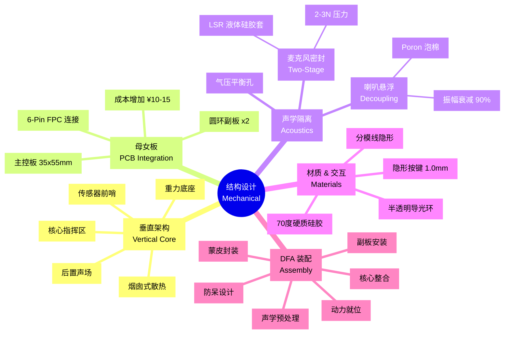

# 结构与物理设计主文档 (Mechanical Design Master Guide)

结构设计不仅仅是做一个"壳子",而是要解决**声学隔离、散热、触感反馈**三大物理难题。本方案采用创新的"**垂直内胆 + 双瓣硅胶**"架构,在兼顾工业美学的同时,完美解决了音频类产品的声学痛点。

---

## 1. 核心架构：垂直内胆堆叠 (Spatial Architecture)

**文档概览：[Spatial_Architecture_and_Skeleton.md](./Spatial_Architecture_and_Skeleton.md)**

### 1.1 烟囱式散热 (Chimney Effect)

**论点**：传统水平堆叠导致热量积聚,我们采用**垂直中轴架构**利用自然对流散热。

**原理**：
- 热空气自然上升。将发热最大的电池和主板垂直放置,利用顶部的隐藏出气孔,形成自然的空气对流。
- **优势**：无需风扇,实现了完全静音的散热,避免了风扇噪音干扰麦克风。

**热管理路径**：
- **热源**：ESP32-S3 模组产生热量,通过 PCB 的 GND 大平面向上导热。
- **通道**：利用"内胆与蒙皮"之间的 **0.2mm 装配间隙**作为热空气通道。
- **出口**：多余热量从背部隐藏按键缝隙或颈部自然泄出。

### 1.2 四大功能分区

| 分区 | 位置 | 核心作用 | 关键约束 |
| :--- | :--- | :--- | :--- |
| **核心指挥区** | 垂直中轴线 | 承载 ESP32-S3 及电源管理 | 主板向后靠,确保 USB-C 接口贴紧背壳开口 |
| **传感器前哨** | 左右突出圆环内 | 数据输入端(麦克风) + 状态输出端(LED 灯环) | 通过 **1.0mm 间距 6-pin FPC** 对称连回主板 |
| **重力底座** | 身体最底部 | 1000mAh 锂电池作为配重 | 提供极佳重心支撑,防止站立不稳 |
| **后置声场** | 后背下方栅栏开口 | 音腔喇叭横置 | 紧贴背部出音网格 |

### 1.3 性能指标

- **RF 指标**：装配好硅胶壳后,Wi-Fi 吞吐量对比裸板衰减 **< 3dB**。
- **热平衡**：持续满载运行 1 小时,外壳表面最高温升 **< 8℃**(防止低温烫伤)。
- **重心稳度**：成品公仔能够平稳站立在 **10° 斜面**上而不倒。

---

## 2. PCB 物理整合：母女板架构 (PCB Integration)

**文档概览：[PCB_Layout_Physical_Constraints.md](./PCB_Layout_Physical_Constraints.md)**

### 2.1 系统拓扑：一主两副

**中央主控板 (Main Logic Board)**：
- **规格**：35mm x 55mm 长条形,垂直高度中心
- **任务**：ESP32-S3 核心、Wi-Fi 天线、3.3V/800mA 供电、2W 音频功放、背部 USB 接口
- **连接**：底部通过 PH2.0 插座连接电池和喇叭

**传感器圆环副板 (Sensor Daughter-boards x 2)**：
- **规格**：圆形,单面贴装,厚度 **1.2mm**
- **任务**：12 颗 WS2812B RGB 灯环(正面)、1 路数字麦克风(背面)

### 2.2 互连协议：FPC 柔性连接

**线序定义 (6-Pin)**：
1. VCC (3.3V)
2. GND
3. WS2812_DATA
4. MIC_BCK
5. MIC_WS
6. MIC_DATA

### 2.3 为什么坚持"母女板"方案？

**成本增加**：每台约 **¥10-15**

**关键理由**（即使增加成本也值得）：
1. **物理过弯装配**：单块大 PCB(十字型)无法从窄小的颈部接口塞入。母女板可分别塞入并就位。
2. **麦克风近场拾音**：副板让麦克风直接贴合圆环导音孔。若使用单板,声音需通过长达 30mm 的导管,会导致 **AEC 算法失效**。
3. **触摸灵敏度保证**：副板紧贴圆环内侧,触摸感应电极行程最短,可有效抑制干扰。

---

## 3. 声学工程设计 (Acoustic Engineering)

**文档概览：[Structural_Stackup_and_Acoustics.md](./Structural_Stackup_and_Acoustics.md)**

**论点**：AI 语音产品的生死线在于"能不能听清"。物理隔离是 AEC 算法生效的前提。

### 3.1 麦克风二级密封 (Two-Stage Sealing)

**挑战**：
如果不密封,喇叭的声音会在机器内部直接传到麦克风(**结构耦合**),导致 AEC 算法失效,产生啸叫。

**方案**：
- **一级密封 (Sleeve)**：在副板 MEMS 麦克风上套入 **LSR 液体硅胶套**(硬度 25-30A)。胶套必须紧贴 PCB 表面。
- **二级密封 (Interface)**：支架支柱对副板施加 **2-3N 的压力**,使胶套顶端与硅胶外壳内壁的"拾音管"形成气密性贴合。

**目标**：物理隔离度 **> 20dB**。

### 3.2 喇叭悬浮与减震 (Speaker Decoupling)

**挑战**：
喇叭震动通过"固体传导"干扰麦克风。

**方案**：
- **浮动安装**：音腔箱体不直接通过螺丝锁在支架上,而是嵌入支架的专属框位。
- **Poron 泡棉缓冲**：在箱体与支架的所有接触面粘贴 **0.5mm - 1.0mm 厚度的 Poron 减震泡棉**。

**目标**：在大音量(85dB @ 10cm)播放时,支架主梁的振幅需衰减 **90% 以上**。

### 3.3 背部格栅防吹哨设计

针对"后背出音"造型:
- **开口率**：背部硅胶格栅的总面积必须大于 **120mm²**(对应 1-1.5 吋喇叭)。
- **孔径**：建议不小于 **1.2mm**,且孔壁需打磨圆滑,防止高速气流产生"吹哨"风噪。
- **导音斜面**：在支架的音腔出音口前方,设计一个 **45° 导流斜面**,将声波导向侧后方及上方。

### 3.4 内部气压平衡 (Pressure Relief)

**必要性**：
全密封硅胶壳在电池发热或握持挤压时,内部气压会剧烈波动,造成 MEMS 麦克风灵敏度漂移甚至损坏。

**方案**：
在公仔底座或背部不显眼处,预留一个直径为 **0.5mm 的呼吸孔**,内侧张贴 **IP67 等级的水汽过滤膜 (ePTFE)**。

---

## 4. 材质与交互设计 (Materials & Interaction)

**文档概览：[Materials_and_Manufacturing.md](./Materials_and_Manufacturing.md)**

### 4.1 核心材质：硬质硅胶

**选材**：
- **硬度**：采用 **70度 Shore A 高抗撕硅胶**。既能保持"双瓣"造型不塌陷,又能提供扎实的手感。
- **表面处理**：喷涂 **哑光手感油 (Skin-feel Oil)**,抗静电等级达到电学防护标准,减少灰尘吸附。

**导光设计**：
- 侧面圆环区域采用 **半透明白色硅胶**。
- 透光率控制在 **40%-60%**,确保 LED 状态灯旋转时无明显噪点。

### 4.2 隐形多功能键 (Hidden Multi-function Button)

**论点**：保持外观的绝对简洁,将电源与配网键设计为"皮下隐藏式"。

**结构组成**：
- **外部**：硅胶蒙皮表面镭雕电源图标,壁厚减薄至 **1.0mm** 以保证按压手感。
- **中间**：由内部支架伸出的 **POM 材质传力柱 (Plunger)**。
- **内部**：主 PCB 上的 3x4mm 贴片轻触按键。

**软件逻辑**：
- **长按 3 秒**：系统开关机
- **双击**：进入 Wi-Fi 配网模式(LED 变黄色流转)
- **短按一次**：停止当前播放或打断 AI 回答

### 4.3 模具分模线隐形处理

**要求**：
- 模具分模线必须避开正面与背面的圆润孤面。
- **路径建议**：分模线沿 **侧面圆环中轴线**延伸至底部两腿内侧。
- **工艺**：采用高精度配合模具,合模缝隙(Flash)控制在 **0.1mm** 以内。

### 4.4 局部壁厚差异化

| 区域 | 壁厚 | 目的 |
| :--- | :--- | :--- |
| **主体区** | 2.2mm ± 0.2mm | 保证硬质硅胶的骨架支撑力 |
| **导光圆环区** | 0.8mm (减薄) | 实现 LED 光能的高清透 |

---

## 5. 装配工艺 (Assembly Process)

**文档概览：[DFA_Assembly_Process.md](./DFA_Assembly_Process.md)**

### 5.1 核心装配逻辑：骨架总装制

**阶段 A (内胆总装)**：在 PC+ABS 支架上完成物理堆叠与电气互连。
**阶段 B (总壳封闭)**：将组装好的内胆完整套入硅胶壳。

### 5.2 详细装配序列

**第 1 步：声学预处理**
- 在喇叭模组框位及副板支柱端面贴附 **0.5mm Poron 泡棉**。
- 将麦克风密封胶套套在副板麦克风上。

**第 2 步：动力与音频就位**
- 将 1000mAh 电池放入底部托盘,背胶固定。
- 将一体化音腔喇叭推入后部卡槽。

**第 3 步：传感器副板安装**
- 将左/右两块传感器副板卡入支撑臂末端的圆盘。
- FPC 排线应顺着手臂槽位导向中心位置。

**第 4 步：大脑核心整合**
- 将 FPC 排线与电池插头预先插在中央主板上。
- 将主板锁定在垂直塔架的 M2 螺丝柱上(2-3 颗螺丝)。
- **核对**：确保主板底端的 USB-C 接口处于定位槽正中心。

**第 5 步：蒙皮封装**
- 撑开硬质硅胶壳,将整个"内胆塔"单向推入。
- 确认两侧圆环与支架手臂对齐,后部格栅与喇叭对齐。

### 5.3 防呆设计 (Poka-Yoke)

**接口防呆**：
- 电池接口：PH2.0(带扣)
- 喇叭接口：SH1.0(不带扣,尺寸极小)
- **防止相互误插**

**颜色管理**：
- 左耳 FPC 标记为蓝色线头
- 右耳 FPC 标记为红色线头
- 防止左右传感器接反

**自锁卡扣**：
喇叭模块采用单向弹性卡扣,推入到位即有"咔"声,无需加胶或额外螺丝。

---

## 6. ID 与硬件映射 (ID to Hardware Mapping)

**文档概览：[ID_to_Hardware_Mapping.md](./ID_to_Hardware_Mapping.md)**

| 外观部件 | 对应功能 | 硬件载体 | PCB/引脚约束 |
| :--- | :--- | :--- | :--- |
| **侧面圆环 (左右对称)** | 语音拾取 | 2 x MEMS 麦克风 | 位于圆环中心,采用 FPC 连接 |
| **侧面圆环 (边缘)** | 视觉反馈 | 12 颗 RGB LED 环 | 围绕圆环布置灯带,3-pin 控制线 |
| **侧面圆环 (表面)** | 捏一捏唤醒 | 电容式触摸感应 | 敷设金属箔或弹簧,连接至 S3 Touch 引脚 |
| **背部下格栅** | 语音输出 | 4Ω 3W 喇叭 + 音腔 | 音腔出音孔需对准格栅 |
| **背部中心接口** | 充电与控制 | USB-C + 物理按键 | 垂直主板后端直接出头 |

---

## 7. 声学性能指标 (Target Metrics)

| 指标 | 目标值 | 验证手段 |
| :--- | :--- | :--- |
| **物理隔离度** | > 20dB | 播放粉红噪音时,对比裸麦与封装麦的录音幅值 |
| **AEC 抑制比 (ERLE)** | > 25dB | 在最大音量下,算法应能过滤掉 95% 以上的回声 |
| **信噪比 (SNR)** | > 60dB | 在静室中,底噪不应干扰到关键词唤醒 |

---

## 8. 质量检查清单 (Quality Checklist)

- [ ] **RF 指标**：装配后 Wi-Fi 吞吐量衰减 < 3dB
- [ ] **热平衡**：满载 1 小时,外壳温升 < 8℃
- [ ] **重心稳度**：能在 10° 斜面上平稳站立
- [ ] **分模线感官**：手指滑过侧缝时无明显刮手感
- [ ] **透光均匀度**：12 颗 LED 开启时,圆环亮度差异 < 15%
- [ ] **按键行程**：硅胶壳厚度 1.5mm 时,按键顶杆高度精确匹配
- [ ] **跌落测试**：1m 高度自由落体,内胆与外皮无偏离
- [ ] **高频串噪测试**：开启 LED 跑马灯循环,监听录音通道是否有"嗡嗡"声
- [ ] **气压偏差测试**：大力挤压公仔,检查唤醒词识别率是否下降

---

## 9. 总结

本结构方案通过"**内胆+外皮**"的分离设计,成功解决了散热与换壳需求；通过严格的**麦克风二级密封**和**喇叭悬浮减震**设计,保障了 AI 语音交互的物理基础。**这是目前消费级 AI 语音公仔的最优解。**
