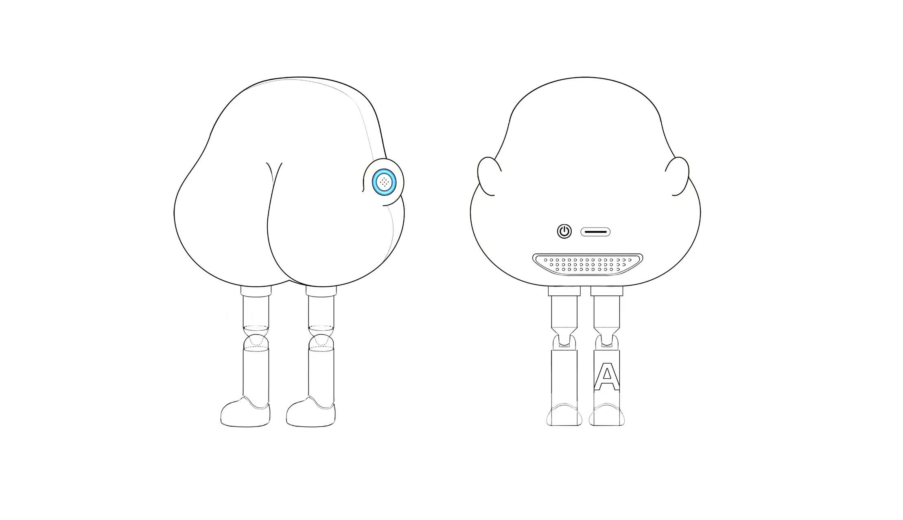
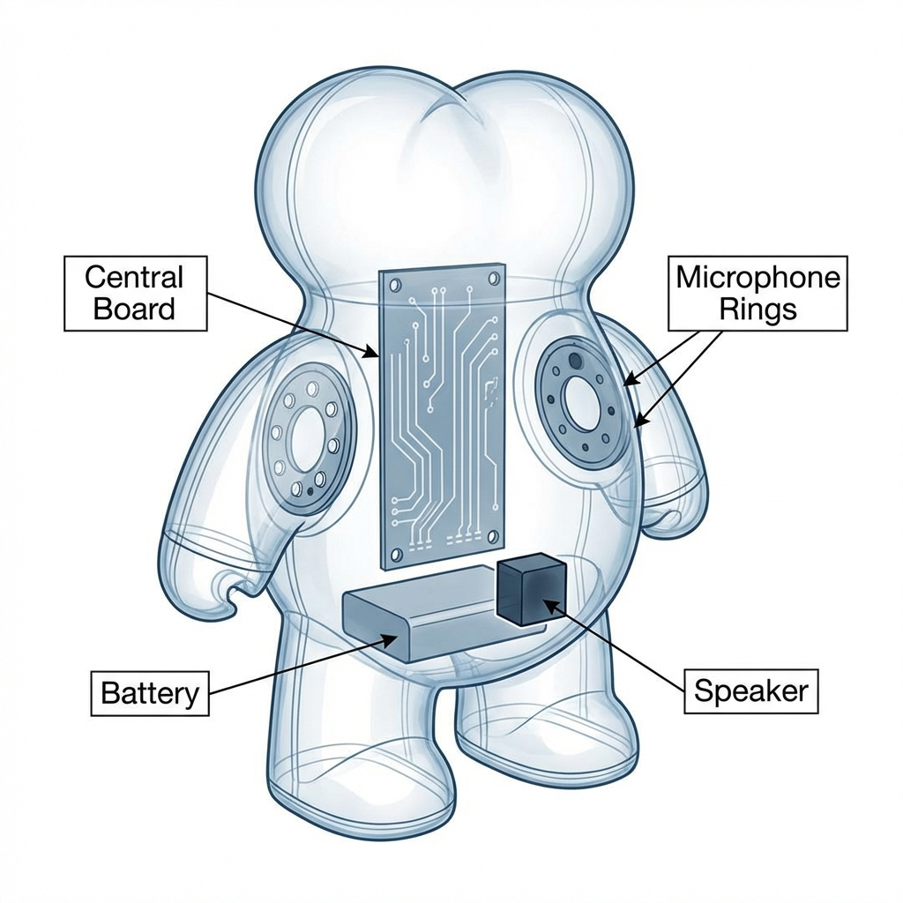
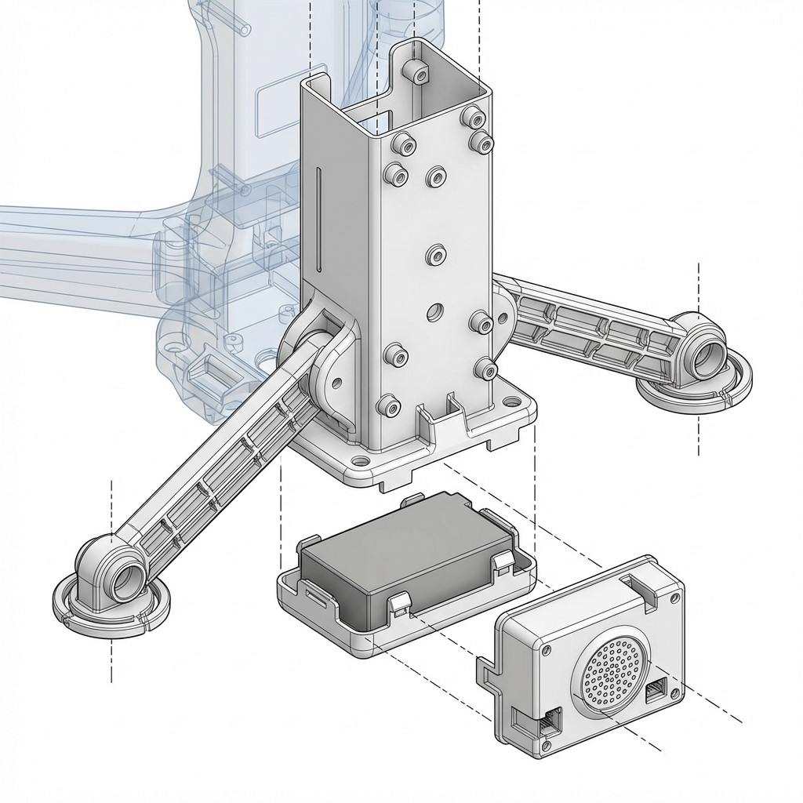

# 空间布局与内部架构 (Spatial Architecture & Skeleton)

基于公仔的“双瓣+侧向圆环”特征，本章节定义内部零件的势力范围分配。通过合理的“分区治标”，解决散热、信号干扰及重心稳定性问题。

---

## 1. 设计参考：外部 ID 造型 (Industrial Design Reference)

在讨论内部结构前，我们以此外部造型为物理边界：

---

## 2. 内部视角图解 (Exploded View)

基于上述“双瓣”外观设计的内部零件透视分布：

---

### 2.1 核心指挥区 (Central Tower) - 主 PCB
- **位置**：垂直于两瓣中心的中轴线。
- **作用**：承载 ESP32-S3 及所有电源管理逻辑。
- **架构决策**：主板向后靠，确保 USB-C 接口及电源键能贴紧背壳开口。

### 2.2 传感器前哨 (Ring Sensors) - 侧向副板
- **位置**：左右两个突出圆环内。
- **作用**：这里是数据的“输入端”（麦克风）和状态的“输出端”（LED 灯环）。
- **连线方式**：通过 **1.0mm 间距 6-pin 排线** 左右对称连回中央主板。

### 2.3 重力底座 (Weight Base) - 电池
- **位置**：身体最底部的空腔，位于两腿连接点上方。
- **作用**：1000mAh 锂电池作为全机最重的零件，放置在底部能提供极佳的重心支撑，防止公仔站立不稳。

### 2.4 后置声场 (Rear Stage) - 音腔喇叭
- **位置**：后背下方栅栏开口内侧。
- **作用**：喇叭模组横置，紧贴背部的出音网格。

---

## 3. 内部支架详细设计 (Internal Chassis/Skeleton Detail)

由于硅胶外壳无法直接承受内部零件的压力，我们必须设计一个硬质塑料骨架（Inner Chassis）。下图展示了该骨架的 3D 分解方案：

### 3.1 核心功能分区说明：

1.  **中央垂直塔 (Central Tower)**：
    *   **作用**：作为整机的“主梁”，正面预留 M2 螺丝柱用于垂直固定主 PCB 板。
    *   **后端开孔**：预留 USB-C 接口穿出槽位，确保物理位置精确对齐。
2.  **横向支撑臂 (Sensor Arms)**：
    *   **作用**：向两侧“瓣状”空间延伸，末端设计有圆形托座，用于支撑麦克风与 LED 环形灯板。
    *   **线束管理**：手臂背面设有凹槽（Cable Channels），引导 FPC 或导线汇集至中心主板，防止装配时被挤压。
3.  **底层电池仓 (Battery Cradle)**：
    *   **作用**：位于底部，采用托盘式结构。电池放入后通过卡扣或背胶固定，确保重心位于最底端。
4.  **后置音腔卡槽 (Speaker Mount)**：
    *   **作用**：支架后下方设有专用的模块框位，用于快速推入“一体化箱体喇叭”。
    *   **减震**：框架内侧需张贴 0.5mm 泡棉，防止喇叭震动传导给主板上的传感器。

---

## 5. RF 与热管理性能保证 (RF & Thermal Performance)

### 5.1 天线净空区 (Antenna Keep-out Area)
- **物理约束**：垂直主板最上端的 **ESP32-S3 天线周围 5mm 半径内**，内部塑料支架严禁设计任何螺丝柱、加强筋。
- **外观约束**：该位置对应的硅胶壳正上方，严禁喷涂金属漆或贴附金属 Logo。

### 5.2 热管理 (Thermal Management)
- **烟囱效应**：热量由 S3 模组产生，通过 PCB 的 GND 大平面向上导热。
- **排热路径**：由于硅胶极度隔热，我们利用“内胆与蒙皮”之间的 **0.2mm 装配间隙** 作为热空气通道。
- **出口**：多余的热量从背部隐藏按键缝隙或颈部自然泄出。

---

## 6. 架构最终 Checklist
- [ ] **RF 指标**：装配好硅胶壳后，Wi-Fi 吞吐量对比裸板衰减是否在 3dB 以内。
- [ ] **热平衡**：持续满载运行 1 小时，外壳表面最高温升不应超过 8℃（防止低温烫伤）。
- [ ] **重心稳度**：成品公仔能够平稳站立在 10° 的斜面上而不倒。
